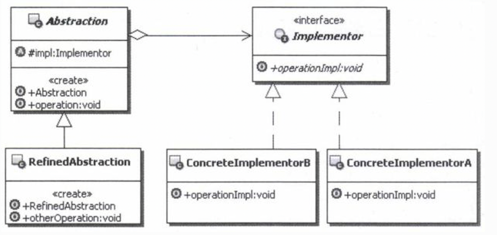
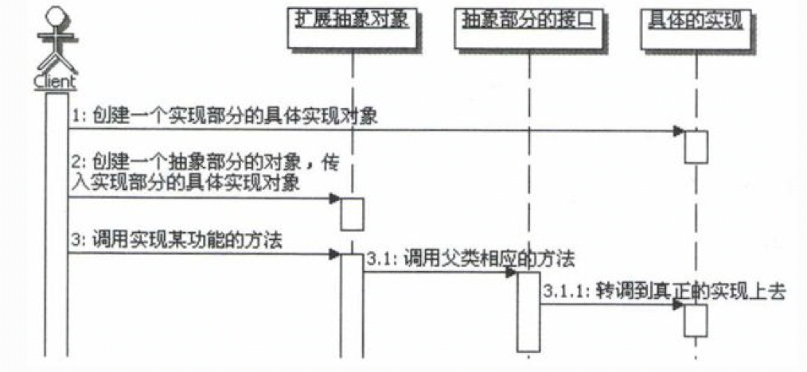
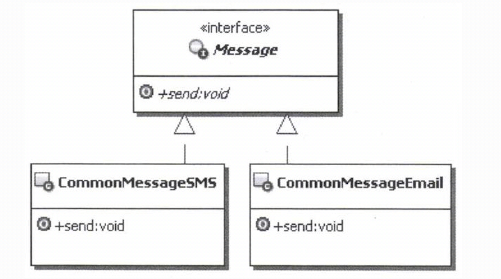
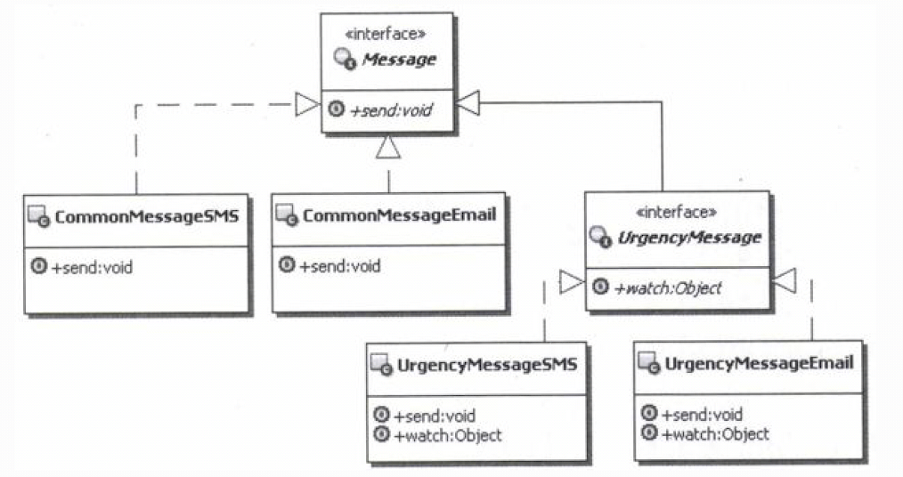

# 1.桥接模式（Bridge）的目的
将抽象部分与它的实现部分分离，使它们都可以独立地变化。 
一个一个来，先看看什么是桥接？所谓桥接，通俗点说就是在不同的东西之间搭一个桥，让它们能 够连接起来，可以相互通讯和使用。那么在桥接模式中到底是
给什么东西来搭桥呢？就是为被分离了的抽象部分和实现部分来搭桥，比如前面示例中在抽象的消息和具体消息发送之间搭个桥。 
# 2.桥接模式的实现
 
说明如下：
- Abstraction：抽象部分的接口。通常在这个对象中，要维护一个实现部分的对象引用，抽象对象里面的方法，需要调用实现部分的对象来完成。这个对象
中的方法，通常都是和具体的业务相关的 方法。
- RefinedAbstraction：扩展抽象部分的接口。通常在这些对象中，定义跟实际业务相关的方法，这些方法的实现通常会使用Abstraction中定义的方法，
也可能需要调用实现部分的对象来完成。
- Implementor：定义实现部分的接口。这个接口不用和Abstraction中的方法一致，通常是由 Implementor接口提供基本的操作。而Abstraction中定
义的是基于这些基本操作的业务方法，也就是说 Abstraction定义了基于这些基本操作的较高层次的操作。
- ConcreteImplementor：真正实现Implementor接口的对象。

 
桥接模式的调用顺序图： 
 

## 2.1.谁来桥接
&nbsp;&nbsp;&nbsp;&nbsp;所谓谁来桥接，就是谁来负责创建抽象部分和实现部分的关系，说得更直白点，就是谁来负责创建 Implementor对象，并把它
设置到抽象部分的对象中去，这点对于使用桥接模式来说，是十分重要的一 点。 
&nbsp;&nbsp;&nbsp;&nbsp;大致有如下几种实现方式:
- 由客户端负责创建Implementor对象，并在创建抽象部分对象的时候，把它设置到抽象部分的 对象中去，前面的示例采用的就是这个方式。
- 可以在抽象部分对象构建的时候，由抽象部分的对象自己来创建相应的Implementor对象，当 然可以给它传递一些参数，它可以根据参数来选择并创建具体的Implementor对象。
- 可以在Abstraction中选择并创建一个默认的Implementor对象，然后子类可以根据需要改变这 个实现。
- 也可以使用抽象工厂或者简单工厂来选择并创建具体的Implementor对象，抽象部分的类可以 通过调用工厂的方法来获取Implementor对象。
- 如果使用IoC/DI容器的话，还可以通过IoC/DI容器来创建具体的Implementor对象，并注入回 到Abstraction中。
# 3.案例说明
&nbsp;&nbsp;&nbsp;&nbsp;考虑这样一个实际的业务功能：发送提示消息。基本上所有带业务流程处理的系统都会有这样的功 能，比如某人有新的工作了
，需要发送一条消息提示他。 
&nbsp;&nbsp;&nbsp;&nbsp;从业务上看，消息又分成普通消息、加急消息和特急消息多种，不同的消息类型，业务功能处理是 不一样的，比如加急消息是
在消息上添加加急，而特急消息除了添加特急外，还会做一条催促的记录， 多久不完成会继续催促；从发送消息的手段上看，又有系统内短消息、手机短消息、邮件等。 
现在要实现这样的发送提示消息的功能，该如何实现呢？

# 3.1.简化版本（无设计模式）
&nbsp;&nbsp;&nbsp;&nbsp;先考虑实现一个简单点的版本，比如，消息只是实现发送普通消息，发送的方式呢，只实现系统内 短消息和邮件。其他的功能，
等这个版本完成后，再继续添加。这样先把问题简单化，实现起来会容易 一点。 
&nbsp;&nbsp;&nbsp;&nbsp;由于发送普通消息会有两种不同的实现方式，为了让外部能统一操作，因此，把消息设计成接口， 然后由两个不同的实现类分别
实现系统内短消息方式和邮件发送消息的方式。此时系统结构如下图所示： 
 

 
&nbsp;&nbsp;&nbsp;&nbsp;上面的实现看起来很简单，对不对？接下来，添加发送加急消息的功能，也有两种发送的方式，同 样是站内短消息和E-mail的方式。 
&nbsp;&nbsp;&nbsp;&nbsp;加急消息的实现不同于普通消息。加急消息会自动在消息上添加加急，然后再发送消息；另外加急 消息会提供监控的方法，让客
户端可以随时通过这个方法来了解对于加急消息处理的进度，比如，相应 的人员是否接收到这个信息，相应的工作是否已经开展等。因此加急消息需要扩展出一个
新的接口，除 了基本的发送消息的功能，还需要添加监控的功能。这个时候，系统的结构如图下所示： 
 
仔细观察上面的系统结构示意图，会发现一个很明显的问题，那就是通过这种继承的方式来扩展消息处理，会非常不方便。 
这意味着，以后每次扩展一下消息处理，都必须要实现这两种处理方式，是不是很痛苦？这还不算完，如果要添加新的实现方式呢？

