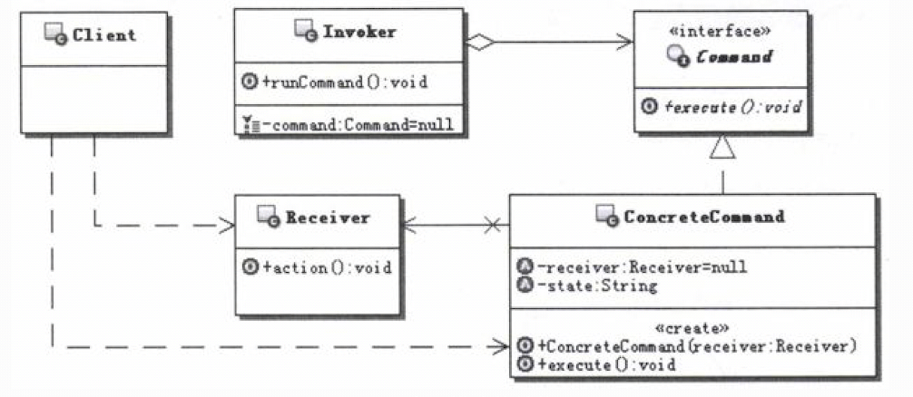
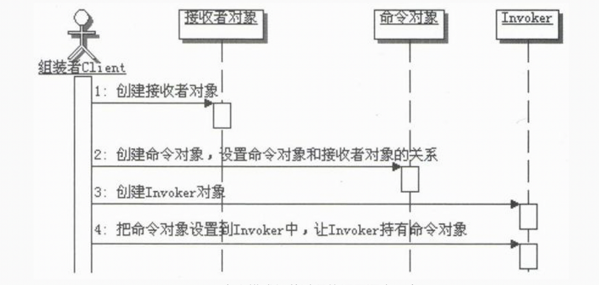
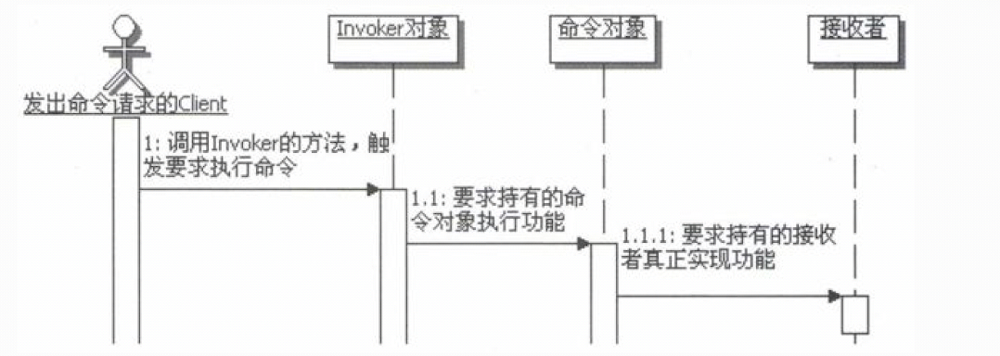
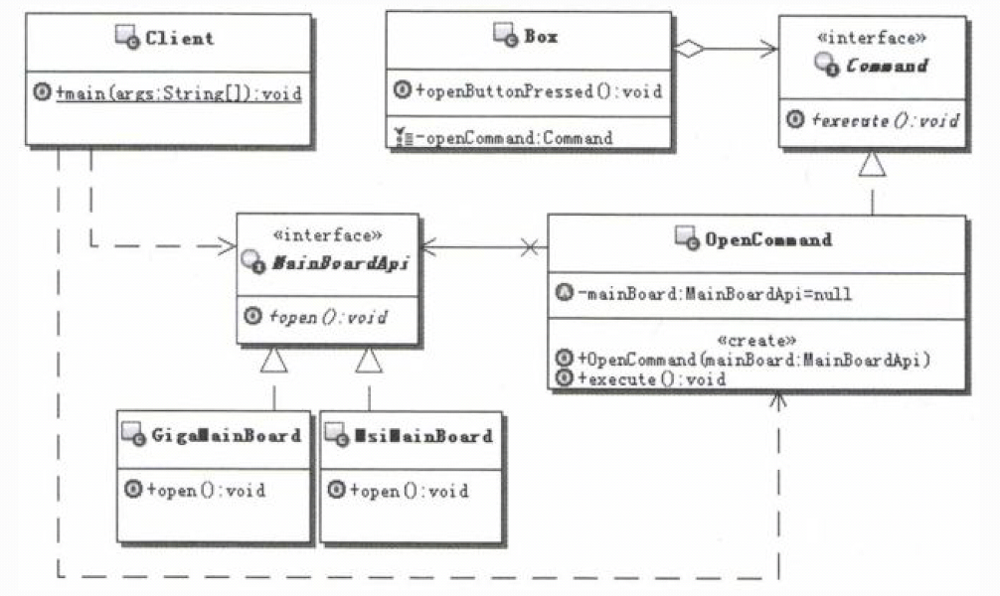

# 1.命令模式的目的
定义：将一个请求封装为一个对象，从而使你可用不同的请求对客户进行参数化；对请求排队或记录请求日志，以及支持可撤销的操作。 
命令模式的关键之处就是把请求封装成为对象，也就是命令对象，并定义了统一的执行操作的接口， 这个命今对象可以被存储、转发．记录、外理、撤销等、整个
命今模式都是围绕这个对象在进行。
# 2.命令模式的实现
&nbsp;&nbsp;&nbsp;&nbsp;在命令模式中，会定义一个命令的接口，用来约束所有的命令对象，然后提供具体的命令实现，每个命令实现对象是对客户端某个
请求的封装，对应于机箱上的按钮，一个机箱上可以有很多按钮，也就相当于会有多个具体的命令实现对象。 

&nbsp;&nbsp;&nbsp;&nbsp;在命令模式中，命令对象并不知道如何处理命令，会有相应的接收者对象来真正执行命令。就像电脑的例子，机箱上的按钮并不
知道如何处理功能，而是把这个请求转发给主板，由主板来执行真正的功 能，这个主板就相当于命令模式的接收者。 

&nbsp;&nbsp;&nbsp;&nbsp;在命令模式中，命令对象和接收者对象的关系，并不是与生俱来的，需要有一个装配的过程，命令模式中的Client对象可以实现
这样的功能。这就相当于在电脑的例子中，有了机箱上的按钮，也有了主板，还需要有一个连接线把这个按钮连接到主板上才行。 

&nbsp;&nbsp;&nbsp;&nbsp;命令模式还会提供一个Invoker对象来持有命令对象。就像电脑的例子，机箱上会有多个按钮，这 个机箱就相当于命令模式的
Invoker对象。这样一来，命令模式的客户端就可以通过Invoker来触发并要 求执行相应的命令了，这也相当于真正的客户是按下机箱上的按钮来操作电脑一样。 
命令模式结构示意图如下： 
 
说明如下： 
- Command：定义命令的接口，声明执行的方法。
- ConcreteCommand： 命令接口实现对象，是“虚”的实现；通常会持有接收者，并调用接收者的功能来完成命令要执行的操作。
- Receiver：接收者，真正执行命令的对象。任何类都可能成为一个接收者，只要它能够实现命令要求实现的相应功能。
- Invoker：要求命令对象执行请求，通常会持有命令对象，可以持有很多的命令对象。这个是客户端真正触发命令并要求命令执行相应操作的地方，也就是
说相当于使用命令对象的入口。
- Client：创建具体的命令对象，并且设置命令对象的接收者。注意这个不是我们常规意义上的客户端，而是在组装命令对象和接收者，或许把这个Client
称为装配者会更好理解，因为真正使用命令的客户端是从Invoker来触发执行。

## 2.1.命令模式的组装和调用
&nbsp;&nbsp;&nbsp;&nbsp;在命令模式中经常会有一个命令的组装者，用它来维护命令的“虚”实现和真实实现之间的关系。如 果是超级智能的命令，也就是
说命令对象自己完全实现好了，不需要接收者，那就是命令模式的退化， 不需要接收者，自然也不需要组装者了。 
&nbsp;&nbsp;&nbsp;&nbsp;而真正的用户就是具体化请求的内容，然后提交请求进行触发就可以了。真正的用户会通过 Invoker来触发命令。 
&nbsp;&nbsp;&nbsp;&nbsp;在实际开发过程中，Client和Invoker可以融合在一起，由客户在使用命令模式的时候，先进行命令 对象和接收者的组装，组
装完成后，就可以调用命令执行请求。 
 
命令模式组装过程的调用示意图： 
 
## 2.2.命令模式的接收者
&nbsp;&nbsp;&nbsp;&nbsp;接收者可以是任意的类，对它没有什么特殊要求，这个对象知道如何真正执行命令的操作，执行时是从Command的实现类里面转调过来。 
&nbsp;&nbsp;&nbsp;&nbsp;一个接收者对象可以处理多个命令，接收者和命令之间没有约定的对应关系。接收者提供的方法个数、名称、功能和命令中的可
以不一样，只要能够通过调用接收者的方法来实现命令对应的功能就可以了。 
 
命令模式执行过程的调用示意图： 
 

## 2.3.可撤销的操作
&nbsp;&nbsp;&nbsp;&nbsp;可撤销操作的意思就是：放弃该操作，回到未执行该操作前的状态。这个功能是一个非常重要的功能，几乎所有的GUI应用中都
有撤销操作的功能。GUI的菜单是命令模式最典型的应用之一，所以总是能在菜单上找到撤销这样的菜单项。 
&nbsp;&nbsp;&nbsp;&nbsp;既然这么常用，那该如何实现呢？ 
&nbsp;&nbsp;&nbsp;&nbsp;有两种基本的思路来实现可撤销的操作，一种是补偿式，又称反操作式，比如被撤销的操作是加的功能，那撤销的实现就变成
减的功能；同理被撤销的操作是打开的功能，那么撤销的实现就变成关闭的功能 
提示： 
这里先讲第一种方式，就是补偿式或者反操作式，第二种方式即存储恢复式，放到备忘录模式中进行讲解。 

## 2.4.宏命令
&nbsp;&nbsp;&nbsp;&nbsp;什么是宏命令呢？简单点说就是包含多个命令的命令，是一个命令的组合 一下你去饭店吃饭的过程。 
&nbsp;&nbsp;&nbsp;&nbsp;宏命令从本质上讲类似于一个命令，基本上把它当命令对象进行处理。但是它跟普通的命令对象又有些不一样，就是宏命令包含
有多个普通的命令对象，简单点说，执行一个宏命令，就是执行宏命令里 面所包含的所有命令对象，有点打包执行的意味。 

# 3.案例说明
## 3.1.电脑如何开机代码实现
&nbsp;&nbsp;&nbsp;&nbsp;对于使用电脑的客户—就是我们来说，开机确实很简单，按下启动按钮，然后耐心等待就可以了。但是当我们按下启动按钮以后，
谁来处理？如何处理？都经历了怎样的过程？才让电脑真正地启动起来，供我们使用。 
&nbsp;&nbsp;&nbsp;&nbsp;先来简单地认识一下电脑的启动过程。做一个了解即可。 
- （1）当我们按下启动按钮，电源开始向主板和其他设备供电。 
- （2）主板的系统BIOS（基本输入输出系统）开始加电后自检。
- （3）主板的BIOS会依次去寻找显卡等其他设备的BIOS，并让它们自检或者初始化。 
- （4）开始检测CPU、内存、硬盘、光驱、串口、并口、软驱、即插即用设备等。 
- （5）BIOS更新ESCD（扩展系统配置数据），ESCD是BIOS和操作系统交换硬件配置数据的一种手段。
- （6）等前面的事情都完成后，BIOS才按照用户的配置进行系统引导，进入操作系统里面，等到操作系统装载并初始化完毕，就出现我们熟悉的系统登录界面了。

 
&nbsp;&nbsp;&nbsp;&nbsp;如果用软件把上面的过程表现出来，该如何实现？ 
&nbsp;&nbsp;&nbsp;&nbsp;首先把上面的过程总结一下。主要有几个步骤：首先加载电源，然后是设备检查，接下来是装载系统，最后电脑就正常启动了。
可是谁来完成这些过程？如何完成呢？ 

### 3.1.1.使用命令模式实现
&nbsp;&nbsp;&nbsp;&nbsp;要使用命令模式来实现示例，需要先把命令模式中所涉及的各个部分，在实际的示例中对应出来， 然后才能按照命令模式的结构
来设计和实现程序。根据前面描述的解决思路，大致对应如下： 
- 机箱上的按钮就相当于是命令对象。
- 机箱相当于是Invoker。
- 主板相当于接收者对象。
- 命令对象持有一个接收者对象，就相当于是给机箱的按钮连上了一根连接线。
- 当机箱上的按钮被按下的时候，机箱就把这个命令通过连接线发送出去。

 
&nbsp;&nbsp;&nbsp;&nbsp;主板类才是真正实现开机功能的地方，是真正执行命令的地方，也就是“接收者”。命令的实现对象，其实是个“虚”的实现，就
如同那根连接线，它哪知道如何实现啊，还不就是把命令传递给连接线连到的主板。 
 

## 3.2.计算机功能（补偿式或反操作式）--实现可撤销的操作
考虑一个计算器的功能，最简单的那种，只能实现加减法运算，现在要让这个计算器支持可撤销的操作。 

## 3.3.计算机功能（存储恢复式）--实现可撤销的操作
需学习备忘录模式后才能理解。

## 3.4.饭店点餐--宏命令实现
&nbsp;&nbsp;&nbsp;&nbsp;什么是宏命令呢？简单点说就是包含多个命令的命令，是一个命令的组合。举个例子来说吧，设想一下你去饭店吃饭的过程。 
- （1）你走进一家饭店，找到座位坐下；
- （2）服务员走过来，递给你菜谱；
- （3）你开始点菜，服务员开始记录菜单，菜单是三联的，点菜完毕，服务员就会把菜单分成三份， 一份给后厨，一份给收银台，一份保留备查；
- （4）点完菜，你坐在座位上等候，后厨会按照菜单做菜；
- （5） 每做好一份菜，就会由服务员送到你桌子上；
- （6） 然后你就可以大快朵颐了。

 
&nbsp;&nbsp;&nbsp;&nbsp;事实上，到饭店点餐是一个很典型的命令模式应用。作为客户的你，只需要发出命令，就是要吃什么菜，每道菜就相当于一个命令
对象，服务员会在菜单上记录你点的菜，然后把菜单传递给后厨，后厨拿到菜单，会按照菜单进行饭菜制作，后厨就相当于接收者，是命令的真正执行者，厨师才知
道每道菜 具体怎么实现。 
&nbsp;&nbsp;&nbsp;&nbsp;在这个过程中，地位比较特殊的是服务员，在不考虑更复杂的管理，比如后厨管理的时候，负责命令和接收者的组装的就是服务员。
比如你点了凉菜、热菜，你其实是不知道到底凉菜由谁来完成，热菜由谁来完成的，因此你只管发命令，而组装的工作就由服务员完成了，服务员知道凉菜送到凉菜
部，那是已经做好的了，热菜才送到后厨，需要厨师现做，看起来服务员是一个组装者。 
&nbsp;&nbsp;&nbsp;&nbsp;同时呢，服务员还持有命令对象，也就是菜单，最后启动命令执行的也是服务员。因此，服务员就相当于标准命令模式中的Client
和Invoker的融合。 

### 3.4.1.宏命令在哪里
&nbsp;&nbsp;&nbsp;&nbsp;仔细观察上面的过程，再想想前面的命令模式的实现，看出点什么没有？
&nbsp;&nbsp;&nbsp;&nbsp;前面实现的命令模式都是客户端发出一个命令，然后马上就执行了这个命令，但是在上面的描述里面呢？是点一个菜，服务员就告
诉厨师，然后厨师就开始做吗？很明显不是的，服务员会一直等，等到你点完菜，当你说“点完了”的时候，服务员才会启动命令的执行，请注意，这个时候执行的就
不是一个命令了，而是执行一堆命令。 
&nbsp;&nbsp;&nbsp;&nbsp;描述这一堆命令的就是菜单，如果把菜单也抽象成为一个命令，就相当于一个大的命令，当客户说 “点完了”的时候，就相当于触
发这个大的命令，意思就是执行菜单这个命令就可以了，这个菜单命令包含多个命令对象，一个命令对象就相当于一道菜。 

那么这个菜单就相当于我们说的宏命令。

## 3.5.饭店点餐--队列请求
&nbsp;&nbsp;&nbsp;&nbsp;所谓队列请求，就是对命令对象进行排队，组成工作队列，然后依次取出命令对象来执行。通常用多线程或者线程池来进行命令队
列的处理，当然也可以不用多线程，就是一个线程，一个命令一个命令地循环处理，就是慢了点。 
&nbsp;&nbsp;&nbsp;&nbsp;继续宏命令的例子。其实在后厨，会收到很多菜单，一般是按照菜单传递到后厨的先后顺序来进行处理。对每张菜单，假定也是按
照菜品的先后顺序进行制作，那么在后厨则自然形成了一个菜品的队列，也就是很多个用户的命令对象的队列。 

&nbsp;&nbsp;&nbsp;&nbsp;后厨有很多厨师，每个厨师都从这个命令队列里面取出一个命令，然后按照命令做出菜来，就相当 于多个线程在同时处理一个队列请求。 
&nbsp;&nbsp;&nbsp;&nbsp;因此后厨就是一个典型的队列请求的例子。 
注意: 
后厨的厨师与命令队列之间是没有任何关联的，也就是说是完全解耦的。命令队列是客户发出的命 令，厨师只是负责从队列里面取出一个，处理，然后再取下一个，再处理，仅此而已，厨师不知道也不 管客户是谁。