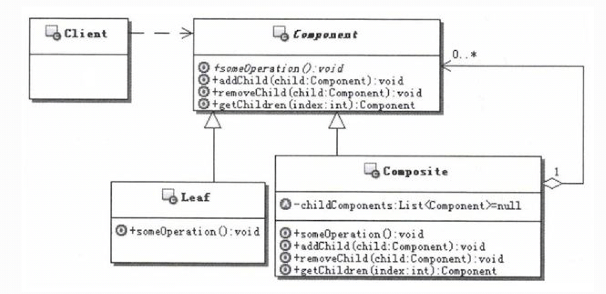
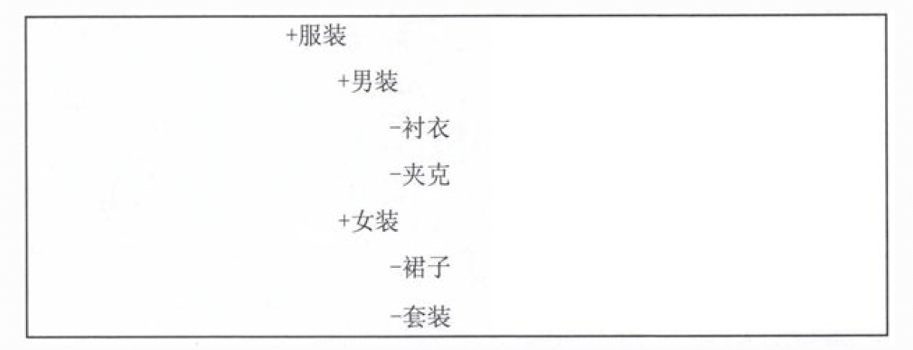

# 1.组合模式（Composite）的目的
定义：将对象组合成树型结构以表示“部分-整体”的层次结构。组合模式使得用户对单个对象和组合对象的使用具有一致性。 
目的：让客户端不再区分操作的是组合对象还是叶子对象，而是以一个统一的方式来操作。 
实现这个目标的关键之处，是设计一个抽象的组件类，让它可以代表组合对象和叶子对象。这样一来，客户端就不用区分到底操作的是组合对象还是叶子对象了，
只需要把它们全部当作组件对象进行统 一的操作就可以了。

# 2.组合模式的实现
 
说明如下： 
- Component：抽象的组件对象，为组合中的对象声明接口，让客户端可以通过这个接口来访 问和管理整个对象结构，可以在里面为定义的功能提供缺省的实现。
- Leaf： 子节点对象，定义和实现叶子对象的行为，不再包含其他的子节点对象。
- Composite：组合对象，通常会存储子组件，定义包含子组件的那些组件的行为，并实现在组件接口中定义的与子组件有关的操作。

# 3.案例说明
&nbsp;&nbsp;&nbsp;&nbsp;考虑这样一个实际的应用：管理商品类别树。
&nbsp;&nbsp;&nbsp;&nbsp;在实现跟商品有关的应用系统的时候，一个很常见的功能就是商品类别树的管理，比如有以下的商品类别树： 
 
&nbsp;&nbsp;&nbsp;&nbsp;仔细观察上面的商品类别树，有以下几个明显的特点。
- 有一个根节点，比如服装，它没有父节点，它可以包含其他的节点。
- 树枝节点，有一类节点可以包含其他的节点，称之为树枝节点，比如男装、女装。
- 叶子节点，有一类节点没有子节点，称之为叶子节点，比如衬衣、夹克、裙子、套装。
&nbsp;&nbsp;&nbsp;&nbsp;现在需要管理商品类别树，假如要求能实现输出如上商品类别树的结构功能，应该如何实现呢？
## 3.1.不用模式实现
&nbsp;&nbsp;&nbsp;&nbsp;要管理商品类别树，就是要管理树的各个节点。现在树上的节点有三类，根节点、树枝节点和叶子 节点，再进一步分析发现，
根节点和树枝节点是类似的，都是可以包含其他节点的节点，把它们称內容器节点。 
&nbsp;&nbsp;&nbsp;&nbsp;这样一来，商品类别树的节点就被分成了两种，一种是容器节点，另一种是叶子节点。容器节点可 以包含其他的容器节点或者
叶子节点。把它们分别实现成为对象，也就是容器对象和叶子对象，容器对象可以包含其他的容器对象或者叶子对象。换句话说，容器对象是一种组合对象。 
&nbsp;&nbsp;&nbsp;&nbsp;然后在组合对象和叶子对象里面去实现要求的功能就可以了。  

&nbsp;&nbsp;&nbsp;&nbsp;**有一个很明显的问题**：那就是必须区分组合对象和叶子对象，并进行有区别的对待，比
如在Composite和Client里面，都需要去区别对待这两种对象。 
&nbsp;&nbsp;&nbsp;&nbsp;区别对待组合对象和叶子对象，不仅让程序变得复杂，还对功能的扩展也带来不便。实际上，大多数情况下用户并不想要去区别
它们，而是认为它们是一样的，这样他们操作起来最简单。
## 3.2.组合模式实现
&nbsp;&nbsp;&nbsp;&nbsp;仔细分析上面不用模式的例子，要区分组合对象和叶子对象的根本原因，就在于没有把组合对象和 叶子对象统一起来。也就是说
，组合对象类型和叶子对象类型是完全不同的类型，这导致了操作的时候 必须区分它们。 
&nbsp;&nbsp;&nbsp;&nbsp;组合模式通过引入一个抽象的组件对象，作为组合对象和叶子对象的父对象，这样就把组合对象和 叶子对象统一起来了，用户使
用的时候，始终是在操作组件对象，而不再去区分是在操作组合对象还是 叶子对象。  

**提示:** 
组合模式的关键就在于这个抽象类，这个抽象类既可以代表叶子对象，也可以代表组合对象，这样用户在操作的时候，对单个对象和组合对象的使用就具有了一致性。

## 3.3.组合模式的删除功能
&nbsp;&nbsp;&nbsp;&nbsp;在上面的示例中，都是在父组件对象中，保存有子组件的引用，也就是说都是从父到子的引用。而本节来讨论一下子组件对象到 
父组件对象的引用，它在实际开发中也是非常有用的。比如： 
- 现在要删除某个商品类别。如果这个类别没有子类别的话，直接删除就可以了，没有太大的问题，但是如果它还有子类别，这就涉及到它的子类别如何处理了，
一种情况是连带全部删除，一种是上移一层，把被删除的商品类别对象的父商品类别，设置成为被删除的商品类别的子类别的父商品类别。
- 现在要进行商品类别的细化和调整，把原本属于A类别的一些商品类别，调整到B类别里面去，某个商品类别的调整会伴随着它所有的子类别一起调整。这样的
调整可能会：把原本是兄弟关系的商品 类别变成了父子关系，也可能会把原本是父子关系的商品类别调整成了兄弟关系，如此等等，会有很多种可能。

 
&nbsp;&nbsp;&nbsp;&nbsp;要实现上述的功能，一个较为简单的方案就是在保持从父组件到子组件引用的基础上，再增加保持 从子组件到父组件的引用，这
样在删除一个组件对象或是调整一个组件对象的时候，可以通过调整父组 件的引用来实现，可以大大简化实现。 

**提示:** 
&nbsp;&nbsp;&nbsp;&nbsp;较为容易的办法就是：在组合对象添加子组件对象的时候，为子组件对象设置父组件的引用；在组合对象删除一个子组件对象的时候，再重新设置相关子组件的父
组件引用。把这些实现到Composite中， 这样所有的子类都可以继承到这些方法，从而更容易地维护子组件到父组件的引用。