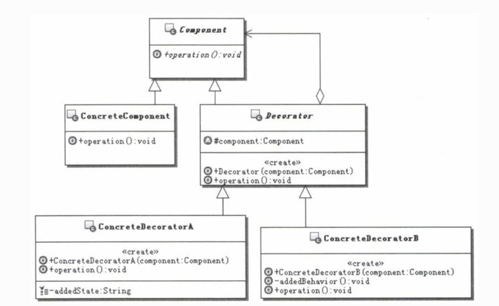
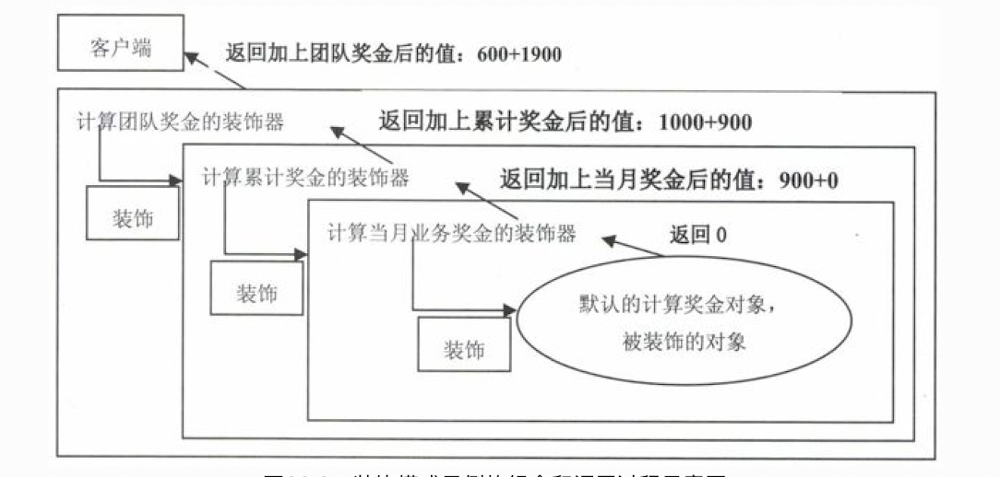

# 1.装饰器模式的目的
目的：动态地给一个对象添加一些额外的职责。就增加功能来说，装饰模式比生成子类更为灵活。 

# 2.装饰器模式的实现
 
- Component：组件对象的接口，可以给这些对象动态地添加职责。
- ConcreteComponent：具体的组件对象，实现组件对象接口，通常就是被装饰器装饰的原始对象，也就是可以给这个对象添加职责。
- Decorator：所有装饰器的抽象父类，需要定义一个与组件接口一致的接口，并持有一个Co-mponent对象，其实就是持有一个被装饰的对象。
- ConcreteDecorator：实际的装饰器对象，实现具体要向被装饰对象添加的功能。

**注意:** 
这个被装饰的对象不一定是最原始的那个对象了，也可能是被其他装饰器装饰过后的对象，反正都是实现的同一个接口，也就是同一类型。

# 3.案例说明
## 3.1.奖金计算
### 3.1.1.复杂的奖金计算
&nbsp;&nbsp;&nbsp;&nbsp;考虑这样一个实际应用：就是如何实现灵活的奖金计算。 
&nbsp;&nbsp;&nbsp;&nbsp;奖金计算是相对复杂的功能，尤其是对于业务部门的奖金计算方式，是非常复杂的，除了业务功能复杂外，还有一个麻烦之处是
计算方式还经常需要变动，因为业务部门要通过调整奖金的计算方式来激励士气。 
&nbsp;&nbsp;&nbsp;&nbsp;下面从业务上看看现有的奖金计算方式的复杂性。 
- 首先是奖金分类，对于个人大致有个人当月业务奖金、个人累计奖金、个人业务增长奖金、及时回款奖金、限时成交加码奖金等；对于业务主管或者是业务经
理，除了个人奖金外，还有团队累计奖金、团队业务增长奖金、团队盈利奖金等。
- 其次是计算奖金的金额，又有这么几个基数，销售额、销售毛利、实际回款、业务成本、奖金基数等。
- 另外一个就是计算的公式，针对不同的人、不同的奖金类别、不同的计算奖金的金额，计算的公式是不同的，即使是同一个公式，里面计算的比例参数也有可能是不同的。
### 3.1.2.简化后的奖金计算
&nbsp;&nbsp;&nbsp;&nbsp;看了上面奖金计算的问题，所幸我们只是来学习设计模式，并不是真的要去实现整个奖金计算体系的业务，因此也没有必要把所
有的计算业务都罗列在这里。为了后面演示的需要，简化一下。演示用的奖金计算体系如下： 
- 每个人当月业务奖金=当月销售额×3%
- 每个人累计奖金=总的回款额x0.1%
- 团队奖金=团队总销售额x1%

