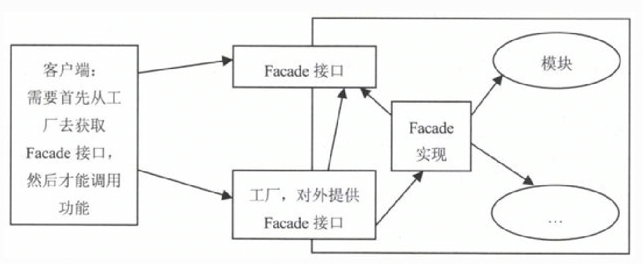
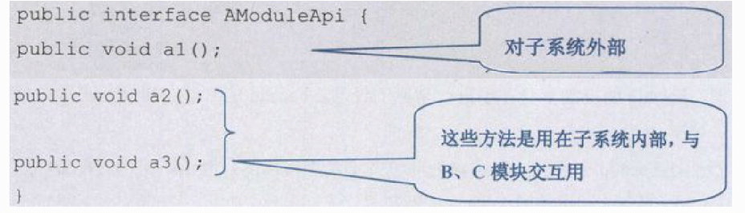
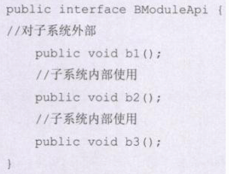
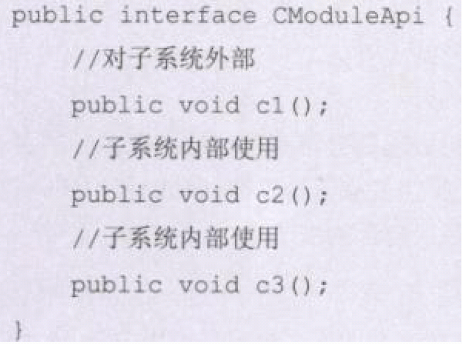
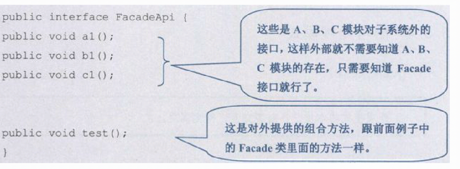
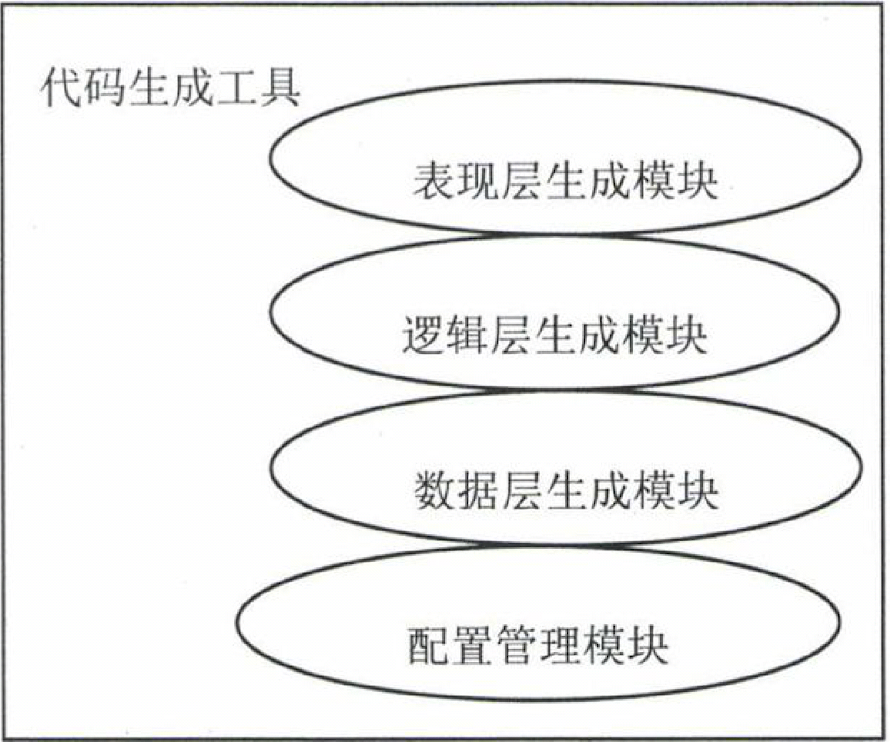
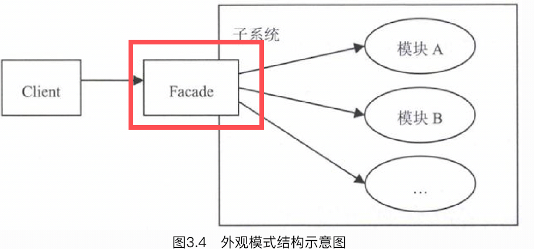
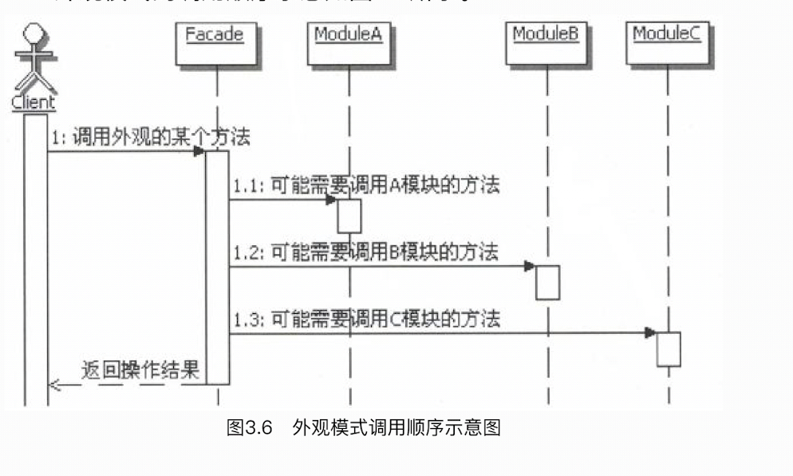

# 1.外观模式的目的
外观模式的目的不是给子系统添加新的功能接口，而是为了让外部减少与子系统内多个模块的交互，松散耦合，从而让外部能够更简单地使用子系统。<br/>
这点要特别注意，因为外观是当作子系统对外的接口出现的， 虽然也可以在这里定义一些子系统没有的功能，但不建议这么做。 <font color="red">**外观应该是包装已有的功能**</font>，它
主要负责组合已有功能来实现客户需要，而不是添加新的实现。
# 2.外观模式的实现
## 2.1.单例
对于一个子系统而言，外观类不需要很多，通常可以实现成为一个单例。<br/>
也可以直接把外观中的方法实现成为静态的方法，这样就可以不需要创建外观对象的实例而直接调用，这种实现相当于把外观类当成一个辅助工具类实现。
## 2.2.接口
虽然Facade通常直接实现成为类，但是也可以把Facade实现成为真正的interface。只是这样会增加系统的复杂程度，因这样会需要一个Facade的实现，还需要一个来获取Facade接口对象的工厂。<br/>
附带好处：
```properties
如果把Facade实现成为接口，还附带一个功能，就是能够有选择性地暴露接口的方法，尽量减少模块对子系统外提供的接口方法。
换句话说，一个模块的接口中定义的方法可以分成两部分，一部分是给子系统外部使用的，一部分是子系统内部的模块间相互调用时使用的。有了Facade接口，那么用于子系统内部的接口功能就不用暴露给子系统的外部了。
```
示意图如下：<br/>
<br/>
附带好处示意图说明：<br/>




# 2.案例说明
考虑这样一个实际的应用：代码生成。<br/>
很多公司都有这样的应用工具，能根据配置生成代码。一般这种工具都是公司内部使用，较为专有的工具，生成的多是按照公司的开发结构来实现的常见的基础功能
，比如增删改查。 这样每次在开发实际应用的时候，就可以以很快的速度把基本的增删改查实现出来，然后把主要的精力都放在业务功能的实现上。<br/>
假设使用代码生成出来的每个模块都具有基本的三层架构，分为表现层、逻辑层和数据层，那么代码生成工具里面就应该有相应的代码生成处理模块。<br/>
另外，代码生成工具自身还需要一个配置管理的模块，通过配置来告诉代码生成工具，每个模块究竟需要生成哪些层的代码。比如，通过配置来描述，是只需要生成
表现层代码呢，还是三层都生成。具体的模块示意如下图所示：<br/>
<br/>
外观模式示意图如下：<br/>
<br/>

外观模式调用顺序图：<br/>
