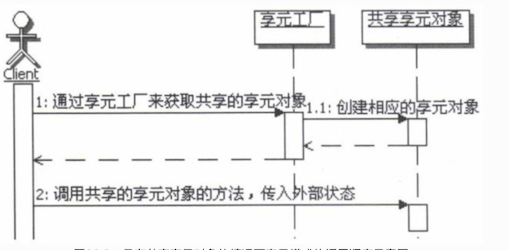
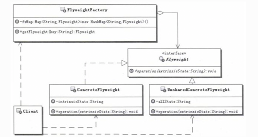
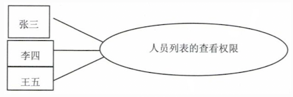
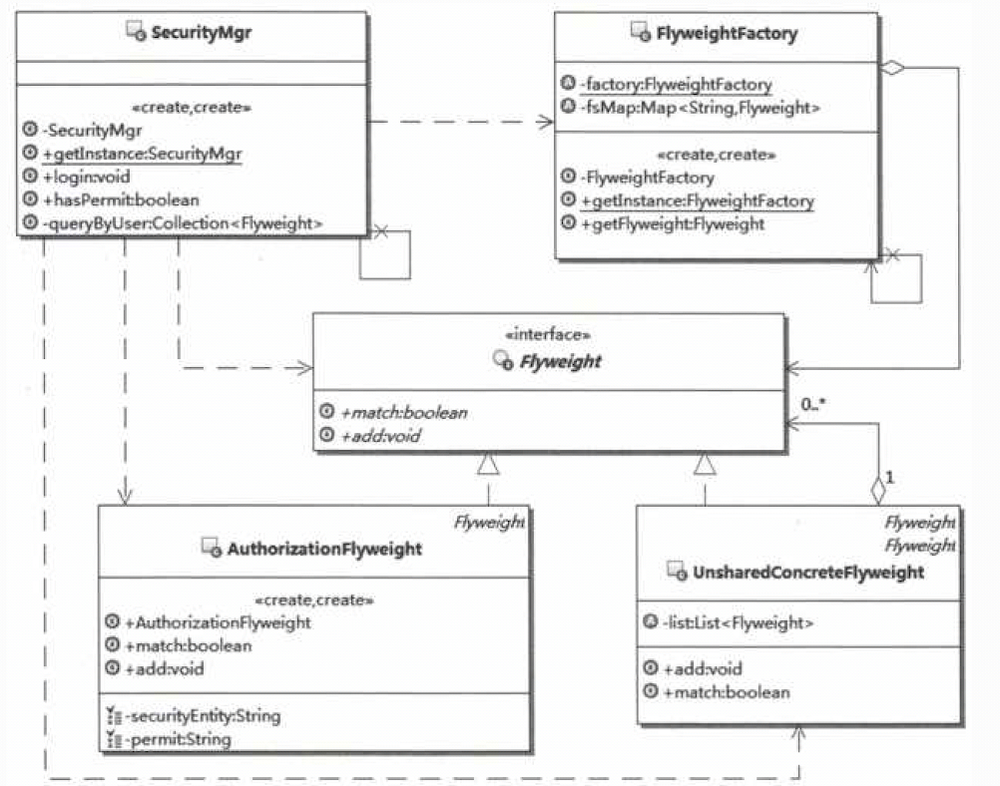

# 1.享元模式（Flyweight）的目的
定义：运用共享技术有效地支持大量细粒度的对象。 
1. 变与不变 
&nbsp;&nbsp;&nbsp;&nbsp;享元模式设计的重点就在于分离变与不变。把一个对象的状态分成内部状态和外部状态，内部状态是不变的，外部状态是可变的。
然后通过共享不变的部分，达到减少对象数 量并节约内存的目的。在享元对象需要的时候，可以从外部传入外部状态给共享的对象，共享对象会在功能处理的时候
，使用自己内部的状态和这些外部的状态。 

2. 共享与不共享 
&nbsp;&nbsp;&nbsp;&nbsp;在享元模式中，享元对象又有共享与不共享之分，这种情况通常出现在和组合模式合用的情况，通常共享的是叶子对象，一般不共
享的部分是由共享部分组合而成的，由于所 有细粒度的叶子对象都已经缓存了，那么缓存组合对象就没有什么意义了。这在后面将给大家一个示例。 

3. 内部状态和外部状态 
&nbsp;&nbsp;&nbsp;&nbsp;享元模式的内部状态，通常指的是包含在享元对象内部的、对象本身的状态，是独立于使用享元的场景的信息，一般创建后就不再
变化的状态，因此可以共享。 
&nbsp;&nbsp;&nbsp;&nbsp;外部状态指的是享元对象之外的状态，取决于使用享元的场景，会根据使用场景而变化，因此不可共享。如果享元对象需要这些外
部状态的话，可以从外部传递到享元对象中， 比如通过方法的参数来传递。 

&nbsp;&nbsp;&nbsp;&nbsp;也就是说享元模式真正缓存和共享的数据是享元的内部状态，而外部状态是不应该被缓存共享的。 
&nbsp;&nbsp;&nbsp;&nbsp;还有一点，内部状态和外部状态是独立的，外部状态的变化不应该影响到内部状态。 
4. 实例池 
&nbsp;&nbsp;&nbsp;&nbsp;在享元模式中，为了创建和管理共享的享元部分，引入了享元工厂。享元工厂中一般都包含有享元对象的实例池，享元对象就是缓
存在这个实例池中的。 

5. 享元模式的调用顺序示意图 
&nbsp;&nbsp;&nbsp;&nbsp;享元模式的使用上，有两种情况，一种是没有“不需要共享”的享元对象，就如同前面的示例那样，只有共享享元对象的情况；还有
一种是既有共享享元对象，又有不需要共享的享元对象的情况，这种情况后面再示例。 
&nbsp;&nbsp;&nbsp;&nbsp;下面看看只有共享享元对象的情况下，享元模式的调用顺序。 
 
   
6. 谁来初始化共享对象 
&nbsp;&nbsp;&nbsp;&nbsp;在享元模式中，通常是在第一次向享元工厂请求获取共享对象的时候，进行共享对象的初始化，而且多半都是在享元工厂内部实现，
不会从外部传入共享对象。当然可以从外 部传入一些创建共享对象需要的值，享元工厂可以按照这些值去初始化需要共享的对象，然后把创建好的共享对象的实例
放入享元工厂内部的缓存中，以后再请求这个共享对象的 时候就不用再创建了。

# 2.享元模式的实现
享元模式的结构示意图： 
 
解释说明如下： 
- Flyweight：享元接口，通过这个接口Flyweight可以接受并作用于外部状态。通过这个接口传入外部的状态，在享元对象的方法处理中可能会使用这些外部的数据。
- ConcreteFlyweight：具体的享元实现对象，必须是可共享的，需要封装Flyweight的内部状态。
- UnsharedConcreteFlyweight：非共享的享元实现对象，并不是所有的Flyweight实现对象都需要共享。非共享的享元实现对象通常是对共享享元对象的组合对象。
- FlyweightFactory：享元工厂，主要用来创建并管理共享的享元对象，并对外提供访问共享享元的接口。
- Client：享元客户端，主要的工作是维持一个对Flyweight的引用，计算或存储享元对象的外部状态，当然这里可以访问共享和不共享的Flyweight对象。

# 3.案例说明
## 3.1.加入权限控制
&nbsp;&nbsp;&nbsp;&nbsp;权限系统的基础知识。几乎所有的权限系统都分成两个部分，一个是授权部分，一个是验证（也叫认证）部分，为了理解它们，
首先解释两个基础的名词：安全实体和权限。 
- 安全实体：就是被权限系统检测的对象，比如工资数据
- 权限：就是需要被校验的权限对象，比如查看、修改等

 
&nbsp;&nbsp;&nbsp;&nbsp;安全实体和权限通常要一起描述才有意义，比如有这样一个描述：“现在要检测登录人员对工资数据是否有查看的权限”，
“工资数据”这个安全实体和“查看”这个权限一定要一起描述。如果只出现安全实体描述，那就变成这样：“现在要检测登录人员对工资数据”，对工资数据干什
么呀，没有后半部分， 一看就知道不完整；当然只有权限描述也不行，那就变成：“现在要检测登录人员是否有查看的权限” ， 对谁的查看权限啊，也不完整。
所以安全实体和权限通常要一起描述。 

&nbsp;&nbsp;&nbsp;&nbsp;了解了上面两个名词，下面来看看什么是授权和验证（也叫认证）。 
- 所谓授权，是指把对某些安全实体的某些权限分配给某些人员的过程
- 所谓验证，是指判断某个人员对某个安全实体是否拥有某个或某些权限的过程

 
&nbsp;&nbsp;&nbsp;&nbsp;也就是说，授权过程即是权限的分配过程，而验证过程则是权限的匹配过程。在目前应用系统的开发中，多数是利用数据库来存放
授权过程产生的数据。也就是说：授权是向数据库中添加数据，或是维护数据的过程，而匹配过程就变成了从数据库中获取相应数据进行匹配的过程了。 

&nbsp;&nbsp;&nbsp;&nbsp;为了让问题相对简化一点，就不去考虑权限的另外两个特征，一个是继承性，一个是最近匹配原则。什么意思呢？还是解释一下： 
- 权限的继承性指的是，如果多个安全实体存在包含关系，而某个安全实体没有相应的权限限制， 那么它会继承包含它的安全实体的相应权限。
比如，某个大楼和楼内的房间都是安全实体，很明显大楼这个安全实体会包含楼内的房间这些安全 实体，可以认为大楼是楼内房间的父级实体。现在来考虑一个
具体的权限—进入某个房间的权限。如 果这个房间没有门，也就是谁都可以进入，相当于这个房间对应的安全实体没有进入房间的权限限制， 那么是不是说所有
的人都可以进入这个房间呢？当然不是，某人能进入这个房间的前提是。这个人要有权限进入这个大楼。也就是说，此时房间这个安全实体，它本身没有进入权限
的限制，但是它会继承父级安全实体的进入权限。
- 权限的最近匹配原则指的是，如果多个安全实体存在包含关系，而某个安全实体没有相应的权限限制，那么它会向上寻找并匹配相应的权限限制，直到找到一
个离这个安全实体最近的拥有相应权限限制的安全实体为止。如果把整个层次结构都寻找完了仍没有匹配到相应权限限制的话，那就说明所有人对这个安全实体都
拥有这个相应的权限限制。

 
&nbsp;&nbsp;&nbsp;&nbsp;继续上面权限继承性的例子，如果现在这个大楼是坐落在某个机关大院内，这就演变成了，要进入某个房间，首先要有进入大楼
的权限，要进入大楼又需要有能进入机关大院的权限。

&nbsp;&nbsp;&nbsp;&nbsp;所谓最近匹配原则就是，如果某个房间没有门，也就意味着这个房间没有进入的权限限制，那么它就会向上继续寻找并匹配，看
看大楼有没有进入的权限限制，如果有就使用这个权限限制，终止寻找； 如果没有，继续向上寻找，直到找到一个匹配的为止。如果最后大院也没有进入的权限
限制，那就变所有人都可以进入到这个房间里面来了。
### 3.1.1.查看部门人员列表的权限
&nbsp;&nbsp;&nbsp;&nbsp;普通人员都有查看本部门人员列表的权限，但是在人员列表中每个人员的薪资数据，普通人员是不可以看到的；而部门经理在查
看本部门人员列表的时候，就可以看到每个人员相应的薪资数据。

#### 3.1.1.1.不用模式的解决方案
思路说明如下： 
&nbsp;&nbsp;&nbsp;&nbsp;由于操作人员进行授权操作后，各人员被授予的权限是记录在数据库中的，刚开始由开发人员提出，每次用户操作系统的时候，
都直接到数据库中去动态查询，以判断该人员是否拥有相应的权限。但很快就被否决掉了，试想一下，用户操作那么频繁，每次都到数据库中动态查询，这会严
重加剧数据库服务器的负担，使系统变慢。 

&nbsp;&nbsp;&nbsp;&nbsp;为了加快系统运行的速度，开发小组决定采用一定的缓存。当每个人员登录的时候，就把该人员能操作的权限获取到，存储在内存
中。这样每次操作的时候，就直接在内存中进行权限的校验，速度会大大加快，这是典型的以空间换时间的做法。 

&nbsp;&nbsp;&nbsp;&nbsp;上述的实现，很简单，而且还考虑了性能的问题，在内存中缓存了每个人相应的权限数据，使得每次判断权限的时候，速度大大加
快，实现得挺不错，难道有什么问题吗？ 
&nbsp;&nbsp;&nbsp;&nbsp;仔细想想，问题就来了，既有缓存这种方式固有的问题，也有我们自己实现上的问题。先说说缓存固有的问题吧。 
- 缓存时间长度的问题，就是这些数据应该被缓存多久。如果是Web应用，这种跟登录人员相关 的权限数据，大多是放在session中进行缓存，当session超时
的时候，就会被清除掉。如果不是Web应用呢？就得自己来控制了。另外就算是在Web应用中，也不一定非要缓存到session超时才清除。总之，控制缓存数据应
该被缓存多长时间，是实现高效缓存的一个问题点。
- 缓存数据和真实数据的同步问题，这里的同步是指数据同步，不是多线程的同步。比如，上面的授权数据是存放在数据库里的，运行的时候缓存到内存中，如果
真实的授权数据在运行期间发生了变化，那么缓存中的数据就应该和数据库中的数据同步，以保持一致，否则数据就错了。如何合理地同步数据，也是实现高效缓
存的一个问题点。
- 缓存的多线程并发控制，对于缓存的数据，有些操作从缓存中取值，有些操作向缓存中添加值，有些操作在清除过期的缓存数据，有些操作在进行缓存和真实数
据的同步。在一个多线程的环境下，如何合理地对缓存进行并发控制，也是实现高效缓存的一个问题点。

 
先简单提这么几个。事实上，实现合理、高效的缓存也不是一件很轻松的事情，好在这些问题都不在我们这次的讨论之列。这里的重心还是来讲述模式，而不是缓
存实现。 

也就是实现上的问题：  
- (1)、一条数据一个对象实例，已知数据库的数据量是很大的，如果有几万条甚至几百万条，会耗费大量的内存;
- (2)、这些对象的粒度都很小，都是简单地描述某一方面的对象，而且很多数据是重复的，在这些大量重复的数据上耗费了很多的内存

 
把上面的问题描述出来就是：在系统当中，存在大量的细粒度对象，而且存在大量的重复数据，严重耗费内存！

#### 3.1.1.2.使用享元模式的解决方案
&nbsp;&nbsp;&nbsp;&nbsp;仔细观察和分析权限控制案例的授权信息，会发现有一些数据是重复出现的，比如：人员列表、薪资数据、查看、修改等。至于人
员相关的数据，考虑到每个描述授权的对象都是和某个人员相关的，所以存放的时候，会把相同人员的授权信息组织在一起，就不去考虑人员数据的重复性了。 

&nbsp;&nbsp;&nbsp;&nbsp;现在造成内存浪费的主要原因：就是细粒度对象太多，而且有大量重复的数据。如果能够有效地减少对象的数量，减少重复的数据，
那么就能够节省不少内存。一个基本的思 路就是缓存这些包含着重复数据的对象，让这些对象只出现一次，也就只耗费一份内存了。 
 
注意: 
&nbsp;&nbsp;&nbsp;&nbsp;但是请注意，并不是所有的对象都适合缓存，因为缓存的是对象的实例，实例里面存放的主要是对象属性的值。因此，如果被缓存
的对象的属性值经常变动，那就不适合缓存了，因为真实对象的属性值变化了，那么缓存中的对象也必须要跟着变化，否则缓存中的数据就跟真实对象的数据不同
步，可以说是错误的数据了。 
&nbsp;&nbsp;&nbsp;&nbsp;因此，需要分离出被缓存对象实例中，哪些数据是不变且重复出现的，哪些数据是经常变化的，真正应该被缓存的数据是那些不变
且重复出现的数据，把它们称为对象的内部状态，而那些变化的数据就不缓存了，把它们称为对象的外部状态。 

&nbsp;&nbsp;&nbsp;&nbsp;这样在实现的时候，把内部状态分离出来共享，称之为享元，通过共享享元对象来减少对内存的占用。把外部状态分离出来，放到
外部，让应用在使用的时候进行维护，并在需要的时候传递给享元对象使用。为了控制对内部状态的共享，并且让外部能简单地使用共享数据，提供一个工厂来管
理享元，把它称为享元工厂。 
 
&nbsp;&nbsp;&nbsp;&nbsp;再次分析上面的授权信息。实际上重复出现的数据主要是对安全实体和权限的描述，又考虑到安全实体和权限的描述一般是不分开
的，那么找出这些重复的描述，比如，人员列表的查看权限。而且这些重复的数据是可以重用的，比如给它们配上不同的人员，就可以组合成为不同的授权描述。 
 

 
&nbsp;&nbsp;&nbsp;&nbsp;在代码实现后，可以看到输出结果中六条中有五条的hashCode是同一个值，可以断定这是同一个对象。也就是说只有两个对象实
例，而前面的实现有六个对象实例。 
&nbsp;&nbsp;&nbsp;&nbsp;通过共享封装了安全实体和权限的对象，无论多少人拥有这个权限，实际的对象实例都是只有一个，这样既减少了对象的数目，又
节省了宝贵的内存空间，从而解决了前面提出的问题。 

## 3.2.不需要共享的享元实现
&nbsp;&nbsp;&nbsp;&nbsp;可能有些朋友看到这个标题会很疑惑，享元不就是要共享的对象吗？不共享，叫什么享元啊？ 
&nbsp;&nbsp;&nbsp;&nbsp;确实有不需要共享的享元实现，这种情况多出现在组合结构中，对于使用已经缓存的享元组合出来的对象，就没有必要再缓存了。
也就是把已经缓存的享元当做叶子结点，组合出来的组合对象就不需要再被缓存了。也把这种享元称为复合享元。 

&nbsp;&nbsp;&nbsp;&nbsp;比如上面的权限描述，如果出现组合权限描述，在这个组合对象中包含很多个共享的权限描述，那么这个组合对象就不用缓存了，
该组合对象的存在只是为了在授权的时候更加方便。 

&nbsp;&nbsp;&nbsp;&nbsp;具体点说吧，比如要给某人分配“薪资数据”这个安全实体的“修改”权限，那么一定会把“薪资数据”的“查看权限”也分配给这个人
。如果按照前面的做法，需要分配两个对象，为了方便，干脆把这两个描述组合起来，打包成一个对象，命名为“操作薪资数据”，那么分配权限的时候，可以这样
描述： 把“操作薪资数据” 分配给 张三。 这句话的意思就相当于： 
- 把“薪资数据”的“查看”权限 分配给 张三
- 把“薪资数据” 的“修改”权限 分配给 张三

 
&nbsp;&nbsp;&nbsp;&nbsp;这样一来，“操作薪资数据”就相当于是一个不需要共享的享元，它实际由享元“薪资数据的查看权限”和享元“薪资数据的修改权限”
这两个享元组合而成，因此“操作薪资数据”本身也就不需要再共享了。 
&nbsp;&nbsp;&nbsp;&nbsp;但是这种组合对象在权限系统中一般不用于验证，也就是说验证的时候还是一个一个进行判断，因为在存储授权信息的时候是一条
一条存储的。但也不排除有些时候始终要检查多个权限，干脆把这些权限打包，然后直接验证是否有这个组合权限，只是这种情况应用得比较少而已。 

### 3.2.1.加入权限控制的复合享元案例
 

### 3.2.2.对享元对象的管理的案例
&nbsp;&nbsp;&nbsp;&nbsp;虽然享元模式对于共享的享元对象实例的管理要求没有实例池对实例管理的要求那么高，但是也还是有很多自身的特点功能，比
如，引用计数、垃圾清除等。 

&nbsp;&nbsp;&nbsp;&nbsp;所谓引用计数，就是享元工厂能够记录每个享元被使用的次数；而垃圾清除，则是大多数缓存管理都有的功能，缓存不能只往里
面放数据，在不需要这些数据的时候，应该把这些数据从缓存中清除，释放相应的内存空间，以节约资源。 

&nbsp;&nbsp;&nbsp;&nbsp;在前面的示例中，共享的享元对象是很多人共享的，基本上可以一直存在于系统中，不用清除。但是垃圾清除是享元对象管理的
一个常见的功能。继续通过示例给大家讲一下，看看如何实现这些常见的功能。 

1. 实现引用计数的基本思路 
&nbsp;&nbsp;&nbsp;&nbsp;要实现引用计数，就在享元工厂中定义一个Map，它的key值与缓存享元对象的key是一样的，而value就是被引用的次数，这样当外部每次获取该享元的时候，就把对应的引用计数取出来加上1，然后再记录回去。

2. 实现垃圾回收的基本思路 
&nbsp;&nbsp;&nbsp;&nbsp;要实现垃圾回收就比较麻烦点，首先要能确定哪些是垃圾？其次是何时回收？还有由谁来回收？如何回收？解决了这些问题，也就实现了垃圾回收。

（1）为了确定哪些是垃圾，一个简单的方案是这样的，定义一个缓存对象的配置对象，在这个对象中描述了缓存的开始时间和最长不被使用的时间，这个时候判断是否垃圾的计算公式如下：当前的时间-缓存的开始时间≥最长不被使用的时间。当然，每次这个对象被使用的时候，就把那个缓存开始的时间更新为使用时的当前时间，也就是说如果一直有人用的话，这个对象是不会被判断为垃圾的。

（2）何时回收的问题，当然是判断出来是垃圾了就可以回收了。

提示

关键是谁来判断垃圾，还有谁来回收垃圾的问题。一个简单的方案是定义一个内部的线程，这个线程在享元工厂被创建的时候就启动运行。由这个线程每隔一定的时间来循环缓存中所有对象的缓存配置， 看看是否是垃圾，如果是垃圾，那就可以启动回收了。

（3）怎么回收呢？这个比较简单，就是直接从缓存的Map对象中删除相应的对象，让这些对象没有引用的地方，那么这些对象就可以等着被虚拟机的垃圾回收来回收了。
