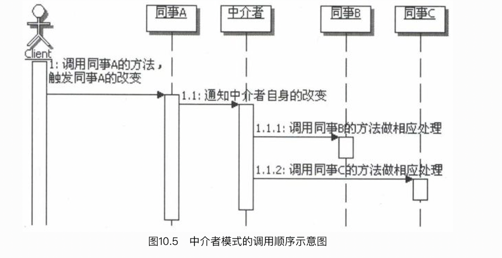
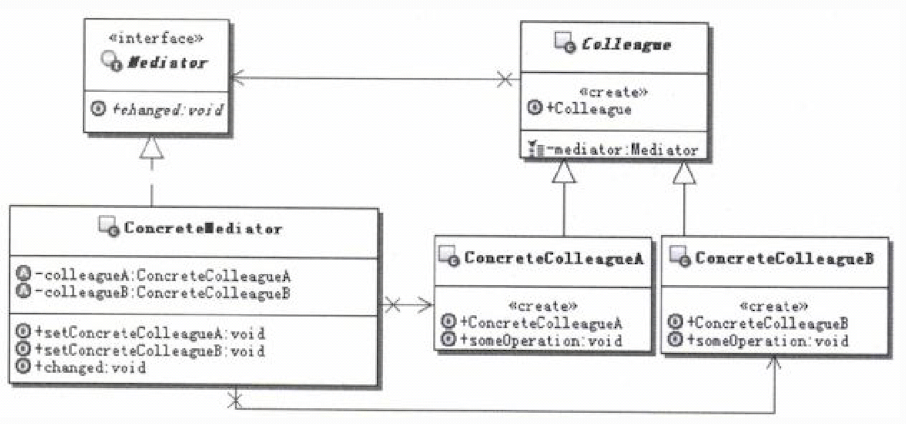
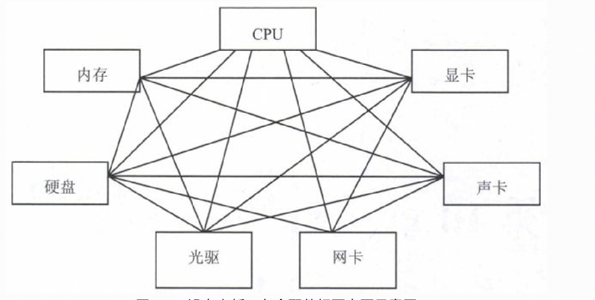
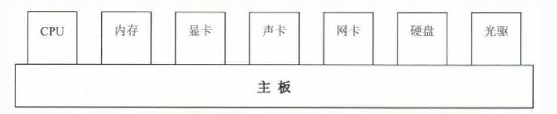
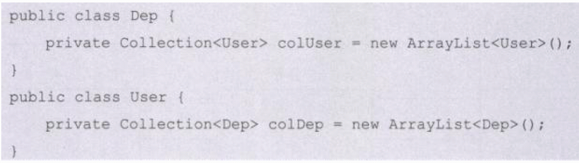
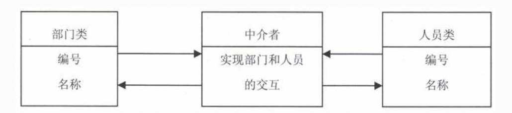

# 1.中介者模式的目的
目的：用一个中介对象来封装一系列的对象交互。 
中介者使得各对象不需要显式地相互引用，从而使其耦合松散，而且可以独立地改变它们之间的交互。 

# 2.中介者模式适用的场景
&nbsp;&nbsp;&nbsp;&nbsp;中介者的功能非常简单，就是封装对象之间的交互。如果一个对象的操作会引起其他相关对象的变化，或者是某个操作需要引起其他对象
的后续或连带操作，而这个对象又不希望自己来处理这些关系， 那么就可以找中介者，把所有的麻烦扔给它，只在需要的时候通知中介者，其他的就让中介者去
处理就可以了。 
&nbsp;&nbsp;&nbsp;&nbsp;反过来，其他的对象在操作的时候，可能会引起这个对象的变化，也可以这么做。最后对象之间就完全分离了，谁都不直接跟其他对象
交互，那么相互的关系全部被集中到中介者对象里面了，所有的对象就只是跟中介者对象进行通信，相互之间不再有联系。 
&nbsp;&nbsp;&nbsp;&nbsp;把所有对象之间的交互都封装在中介者当中，无形中还可以得到另外一个好处，就是能够集中地控制这些对象的交互关系，这样当有变
化的时候，修改起来就很方便。
# 3.中介者模式的实现
&nbsp;&nbsp;&nbsp;&nbsp;一个同事对象发生了改变，会通知中介者对象，中介者对象会处理与其他同事的交互，这就产生了同事对象和中介者对象的相互通
信。怎么实现这种通信关系呢？ 
&nbsp;&nbsp;&nbsp;&nbsp;一种实现方式是在Mediator接口中定义一个特殊的通知接口，作为一个通用的方法，让各个同事类来调用这个方法，在中介者模
式结构图里画的就是这种方式。在前面示例的也是这种方式，定义了一个通用的changed方法，并且把同事对象当做参数传入，这样在中介者对象里面，就可以去
获取这个同事对象的实例的数据了。 
&nbsp;&nbsp;&nbsp;&nbsp;另外一种实现方式是可以采用观察者模式，把Mediator实现成为观察者，而各个同事类实现成为Subject，这样同事类发生了改
变，会通知Mediator。Mediator在接到通知以后，会与相应的同事对象进行交互。 
调用顺序示意图： 
 

中介者模式的实现示意图： 
 
- Mediator：中介者接口。在里面定义各个同事之间交互需要的方法，可以是公共的通信方法，比如changed方法，大家都用， 也可以是小范围的交互方法。
- ConcreteMediator：具体中介者实现对象。它需要了解并维护各个同事对象，并负责具体的协调各同事对象的交互关系。
- Colleague：同事类的定义，通常实现成为抽象类，主要负责约束同事对象的类型，并实现一些具体同事类之间的公共功能， 比如，每个具体同事类都应该知
 道中介者对象，也就是具体同事类都会持有中介者对象，都可以定义到这个类里面。
- ConcreteColleague：具体的同事类，实现自己的业务，在需要与其他同事通信的时候，就与持有的中介者通信，中介者会负责与其他的同事交互。
# 4.广义中介者模式
## 4.1.标准中介者模式的特点
标准的中介者模式, 具有的特点： 
- 1.同事对象共同实现一个公共的父类（Colleague）
- 2.同事类持有中介者对象
- 3.中介者对象持有所有的同事对象
- 4.中介者对象提供一个公共的方法来接受同事对象的通知
 
思考： 
- 1.实际开发中，很多相互交互的对象是没有公共父类的
- 2.同事类持有中介者对象是否有必要（单例？）
- 3.中介者对象持有所有同事，属性强烈依赖，是否有必要？
- 4.在公共方法里，还是要去区分到谁调过来，这还是简单的，还没有去区分到底是什么样的业务触发调用过来的，
因为不同的业务，引起的与其他对象的交互是不一样的。
 
基于上面的考虑, 在实际应用开发中，经常会简化中介者模式，来使开发变得简单。
## 4.2.广义中介者模式的特点
广义中介者模式其实是对标准中介者模式的简化，以使开发变得简单。比如如下的简化： 
- 1.通常会去掉同事对象的父类，这样可以让任意的对象，只要需要相互交互，就可以成为同事。
- 2.通常不定义Mediator接口，把具体的中介者对象实现成为单例。
- 3.同事对象不再持有中介者，而是在需要的时候直接获取中介者对象并调用；中介者也不再持有同事对象，而是在具体处理方法里面去创建，或者获取，或者从参数传入需要的同事对象。
# 5.案例说明
## 5.1.电脑（标准中介者）
大家都知道，电脑里面各个配件之间的交互，主要是通过主板来完成的（事实上主板有很多的功能，这里不去讨论）。试想一下， 如果电脑里面没有主板，会怎
样呢？ 
如果电脑里面没有了主板，那么各个配件之间就必须自行相互交互，以互相传送数据。理论上说，基本上各个配件相互之间都存在交互数据的可能。如下所示： 
 
这也太复杂了吧，这还没完呢，由于各个配件的接口不同，那么相互之间交互的时候，还必须把数据接口进行转换才能匹配上， 那就更恐怖了。 
如果此时有个中间方，帮助协调各个配件之间的通信，那就简单多了。也就是主板。 

## 5.2.部门与人员（广义中介者）
&nbsp;&nbsp;&nbsp;&nbsp;几乎在每个应用系统中都需要这样的功能模块：部门管理和人员管理，为了简单点演示，把模块简化成类，也就是有一个部门类
Dep和人员类User。 
&nbsp;&nbsp;&nbsp;&nbsp;首先想想部门类Dep和人员类User之间是什么关系，一对一？一对多？还是多对多？ 
&nbsp;&nbsp;&nbsp;&nbsp;可能在不同的系统里面，根据需要会做成不同的关系。但从实际情况讲，部门和人员应该是多对多的，也就是一个部门可以有多
个人，而一个人也可以加入多个部门。 
&nbsp;&nbsp;&nbsp;&nbsp;对于一个部门有多个人，估计大家都能理解。而一个人也可以加入多个部门，或许有些朋友就觉得有些问题了，因为在他们做系
统的经验上，是一个人只属于一个部门的。 
&nbsp;&nbsp;&nbsp;&nbsp;事实上一个人是可以属于多个部门的，比如，某人是开发部的经理，同时也是销售部门的技术总监， 为销售部门给客户的解决方
案中的技术部分进行把关，同时还可以是客户服务部门的技术顾问，为他们解决客户的技术问题提供指导。 
好了，理解了部门和人员是多对多的关系以后，有些朋友可能会做出如下的设计，不就是个多对多吗，类之间的多对多也很容易表达啊，如下： 
 
### 5.2.1.传统模式的问题
&nbsp;&nbsp;&nbsp;&nbsp;真的这么简单吗？再进一步想想部门和人员的功能交互，就会知道这样设计是存在问题的，举几个常见的功能： 
- 部门被撤销；
- 部门之间进行合并；
- 人员离职；
- 人员从一个部门调职到另外一个部门
 

&nbsp;&nbsp;&nbsp;&nbsp;想想要实现这些功能，按照前面的设计，该怎么做呢？ 
(1).系统运行期间部门被撤销了，就意味着这个部门不存在了。可是原来这个部门下所有的人员， 每个人员的所属部门中都有这个部门呢，那么就需要先通知
所有的人员，把这个部门从他们的所属部门中去掉，然后才可以清除这个部门。 
(2).部门合并。是合并成一个新的部门呢，还是把一个部门并入到另一个部门？如果是合并成一个新的部门，那么需要把原有的两个部门撤销，然后再新增一个
部门；如果是把一个部门合并到另一个部门里面，那就是撤销掉一个部门，然后把这个部门下的人员移动到这个部门。不管是哪种情况，都面临着需要通知相应的
人员进行更改这样的问题。 
(3).人员离职了，反过来就需要通知他所属于的部门，从部门的拥有人员的记录中去除这个人员。 
(4).人员调职，同样需要通知相关的部门，先从原来的部门中去除掉，然后再到新的部门中添加上。 
 
看了上述的描述，感觉如何？是不是就一个字“烦”啊！ 
麻烦的根源在什么地方呢？仔细想想，对了，麻烦的根源就在于部门和人员之间的耦合，这样导致操作人员的时候，需要操作所有相关的部门，而操作部门的时
候又需要操作所有相关的人员，使得部门和人员搅和在了一起。 
### 5.2.2.广义中介者解决问题
找到了根源就好办了，采用中介者模式，引入一个中介者对象来管理部门和人员之间的关系，就能解决这些问题了。 
如果采用标准的中介者模式，想想上面提出的那些问题点吧，就知道实现起来会很别扭。因此采用广义的中介者来解决，这样部门和人员就完全解耦了，也就是
说部门不知道人员，人员也不知道部门， 它们完全分开，它们之间的关系就完全由中介者对象来管理了。这个时候的结构如下所示： 

