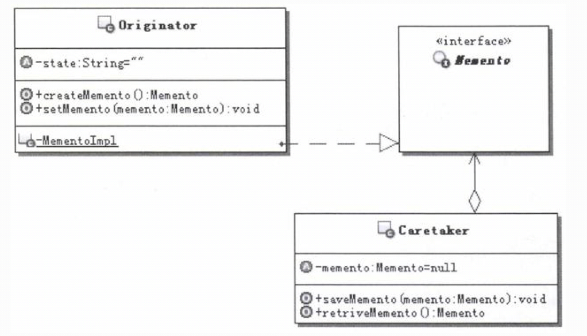
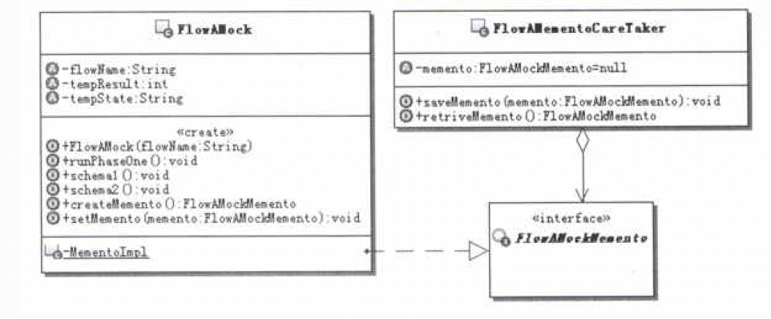

# 1.备忘录模式（Memento）的目的
定义：在不破坏封装性的前提下，捕获一个对象的内部状态，并在该对象之外保存这个状态。这样以后就可将该对象恢复到原先保存的状态。 
一个备忘录是一个对象，它存储另一个对象在某个瞬间的内部状态，后者被称为备忘录的原发器。 
# 2.备忘录模式的实现
 
模式的说明如下： 
- Memento：备忘录。主要用来存储原发器对象的内部状态，但是具体需要存储哪些数据是由原发器对象来决定的。另外备忘录应该只能由原发器对象来访问它内
部的数据，原发器外部的对象不应 该访问到备忘录对象的内部数据。

- Originator：原发器。使用备忘录来保存某个时刻原发器自身的状态，也可以使用备忘录来恢复内部状态。

- Caretaker：备忘录管理者，或者称为备忘录负责人。主要负责保存备忘录对象，但是不能对备忘录对象的内容进行操作或检查。

# 3.案例说明
## 3.1.开发仿真系统
&nbsp;&nbsp;&nbsp;&nbsp;考虑这样一个仿真应用，功能是，模拟运行针对某个具体问题的多个解决方案，记录运行过程的各种数据，在模拟运行完成以后，
方便对这多个解决方案进行比较和评价，从而选定最优的解决方案。 

&nbsp;&nbsp;&nbsp;&nbsp;这种仿真系统，在很多领域都有应用，比如工作流系统，对同一问题制定多个流程，然后通过仿真运行，最后来确定最优的流程作
为解决方案；在工业设计和制造领域，仿真系统的应用就更广泛了。 

&nbsp;&nbsp;&nbsp;&nbsp;由于都是解决同一个具体的问题，这多个解决方案并不是完全不一样的，假定它们的前半部分运行是完全一样的，只是在后半部分
采用了不同的解决方案，后半部分需要使用前半部分运行所产生的数据。 

&nbsp;&nbsp;&nbsp;&nbsp;由于要模拟运行多个解决方案，而且最后要根据运行结果来进行评价，这就意味着每个方案的后半部分的初始数据应该是一样的。
也就是说在运行每个方案后半部分之前，要保证数据都是由前半部分运 行所产生的数据。当然，这里并不具体地去深入到底有哪些解决方案，也不去深入到底有哪
些状态数据， 只是示意一下。 

&nbsp;&nbsp;&nbsp;&nbsp;那么，这样的系统该如何实现呢？尤其是每个方案运行需要的初始数据应该一样，要如何来保证呢？ 

### 3.1.1.不用模式的解决方案
&nbsp;&nbsp;&nbsp;&nbsp;要保证初始数据的一致，实现思路也很简单： 
- （1）首先模拟运行流程第一个阶段，得到后阶段各个方案运行需要的数据，并把数据保存下来，以备后用。
- （2）每次在模拟运行某一个方案之前，用保存的数据去重新设置模拟运行流程的对象，这样运行后面不同的方案时，对于这些方案，初始数据就是一样的了。

### 3.1.2.应用备忘录模式的解决方案(小数据缓存)
&nbsp;&nbsp;&nbsp;&nbsp;仔细分析上面的示例功能，需要在运行期间捕获模拟流程运行对象的内部状态。这些需要捕获的内部状态就是它运行第一个阶段产
生的内部数据，并且在该对象之外来保存这些状态，因为在后面它有不同的运行方案。但是这些不同的运行方案需要的初始数据是一样的，都是流程在第一个阶段
运行所产生的数据，这就要求运行每个方案后半部分前，要把该对象的状态恢复到第一个阶段运行结束时的状态。 

&nbsp;&nbsp;&nbsp;&nbsp;在这个示例中出现的、需要解决的问题就是：如何能够在不破坏对象的封装性的前提下，来保存和恢复对象的状态。 

&nbsp;&nbsp;&nbsp;&nbsp;看起来跟备忘录模式要解决的问题是如此的贴切，备忘录模式简直像是专为这个应用打造的一样。 
&nbsp;&nbsp;&nbsp;&nbsp;那么使用备忘录模式如何来解决这个问题呢？ 

&nbsp;&nbsp;&nbsp;&nbsp;备忘录模式引入一个存储状态的备忘录对象，为了让外部无法访问这个对象的值，一般把这个对象实现成为需要保存数据的对象
的内部类，通常还是私有的。这样一来，除了这个需要保存数据的对象， 外部无法访问到这个备忘录对象的数据，这就保证了对象的封装性不被破坏。 

&nbsp;&nbsp;&nbsp;&nbsp;但是这个备忘录对象需要存储在外部。为了避免让外部访问到这个对象内部的数据，备忘录模式引入了一个备忘录对象的窄接口，
这个接口一般是空的，什么方法都没有，这样外部存储的地方，只是知道存储了一些备忘录接口的对象，但是由于接口是空的，它们无法通过接口去访问备忘录对
象内部的数据。 

#### 3.1.2.1.实现说明
学习了备忘录模式的基本知识以后，尝试一下使用备忘录模式把前面的示例重写，来看看如何使用备忘录模式。 
- （1）首先，那个模拟流程运行的对象就相当于备忘录模式中的原发器； 
- （2）而它要保存的数据，原来是零散的，现在做一个备忘录对象来存储这些数据，并且把这个备忘录对象实现成为内部类；
- （3）当然为了保存这个备忘录对象，还是需要提供管理者对象的；
- （4）为了和管理者对象交互，管理者需要知道保存对象的类型，那就提供一个备忘录对象的窄接口来供管理者使用，相当于标识了类型。

 
 

### 3.1.2.应用备忘录模式的解决方案(保存原发器对象全部或大部分状态)+原型模式
&nbsp;&nbsp;&nbsp;&nbsp;在原发器对象创建备忘录对象的时候，如果原发器对象中全部或者大部分的状态都需要保存，一个简洁的方式就是直接克隆一个
原发器对象。也就是说，这个时候备忘录对象中存放的是一个原发器对象的实例。 
大致变化如下： 
- (1) 原发器对象要实现可克隆的，好在这个原发器对象的状态数据都很简单，都是基本数据类型，所以直接使用默认的克隆方法就可以了，不用自己实现克隆，
更不涉及深度克隆，否则，正确实现深度 克隆还是个问题。
- (2) 备忘录对象的实现要修改，只需要存储原发器对象克隆出来的实例对象就可以了。 
- (3) 相应的创建和设置备忘录对象的地方都要做修改。