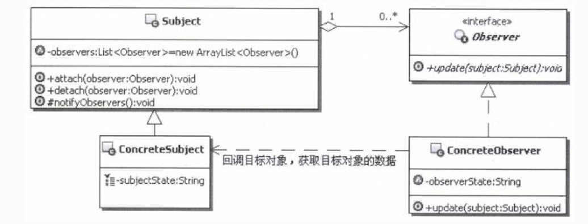
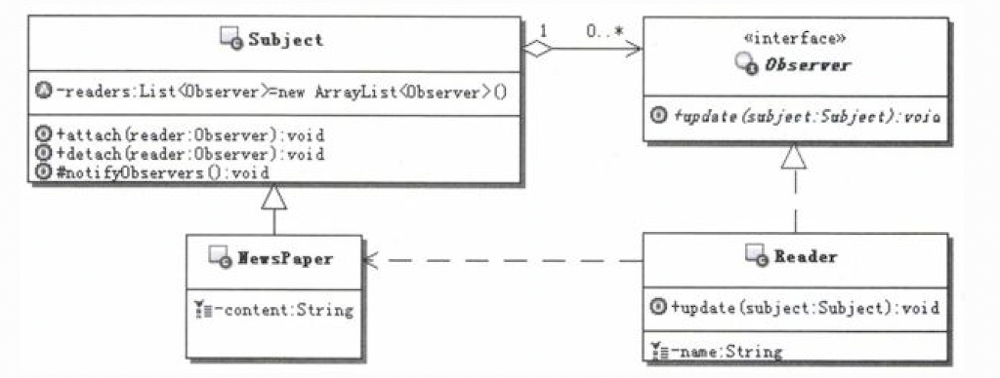

# 1.观察者模式的目的
定义对象间的一种一对多的依赖关系。当一个对象的状态发生改变时，所有依赖于它的对象都得到通知并被自动更新。

# 2.观察者模式的实现
 
- Subject： 目标对象，通常具有如下功能:
  - 一个目标可以被多个观察者观察。
  - 目标提供对观察者注册和退订的维护。
  - 当目标的状态发生变化时，目标负责通知所有注册的、有效的观察者。
- Observer：定义观察者的接口，提供目标通知时对应的更新方法，这个更新方法进行相应的业务处理，可以在这个方法里面回调目标对象，以获取目标对象的数据。
- ConcreteSubject：具体的目标实现对象，用来维护目标状态，当目标对象的状态发生改变时， 通知所有注册的、有效的观察者，让观察者执行相应的处理。
- ConcreteObserver：观察者的具体实现对象，用来接收目标的通知，并进行相应的后续处理， 比如更新自身的状态以保持和目标的相应状态一致。

# 3.案例说明
来考虑实际生活中订阅报纸的过程，这里简单总结了一下订阅报纸的基本流程，如下： 
（1）首先按照自己的需要选择合适的报纸，具体的报刊杂志目录可以从邮局获取。 
（2）选择好后，就到邮局去填写订阅单，同时交纳所需的费用。 
至此，就完成了报纸的订阅过程，接下来就是耐心等候，报社会按照出报时间推出报纸，然后报纸会被送到每个订阅人的手里。 
 