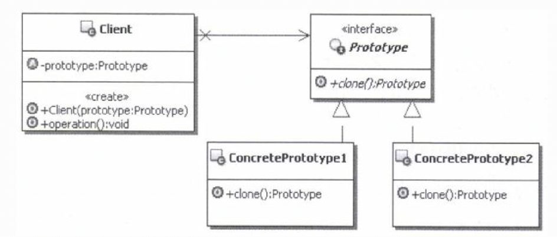

# 1.原型模式的目的
目的：用原型实例指定创建对象的种类，并通过拷贝这些原型创建新的对象。 
原型模式要实现的主要功能就是：通过克隆来创建新的对象实例。 
一般来讲，新创建出来的实例的数据是和原型实例一样的。但是具体如何实现克隆，需要由程序员自行实现，原型模式并没有统一的要求和实现算法。 
换言之，新创建出来的实例数据由程序员具体是浅克隆还是深克隆。
# 2.原型模式的实现
 
- Prototype：声明一个克隆自身的接口，用来约束想要克隆自己的类，要求它们都要实现这里定义的克隆方法。(在java中提供原生接口Clonable)
- ConcretePrototype：实现Prototype接口的类，这些类真正实现了克隆自身的功能。`
- Client：使用原型的客户端，首先要获取到原型实例对象， 然后通过原型实例克隆自身来创建新的对象实例。
# 3.案例说明
&nbsp;&nbsp;&nbsp;&nbsp;考虑这样一个实际应用：订单处理系统。 
&nbsp;&nbsp;&nbsp;&nbsp;现在有一个订单处理的系统，里面有一个保存订单的业务功能。 在这个业务功能中，客户有这样一个需求：每当订单的预定产品数量超过1000的时候，就需要把订
单拆成两份订单来保存。如果拆成两份订单后，还是超过1000，那就继续拆分，直到每份订单的预定产品数量不超过1000。至于为什么要拆分，原因是方便进行订
单的后续处理，后续是由人工来处理，每个人工工作小组的处理能力上限是1000。 
&nbsp;&nbsp;&nbsp;&nbsp;根据业务，目前的订单类型被分成两种：一种是个人订单，一种是公司订单。现在想要实现一个通用的订单处理系统，也就是说， 不管具体是什么类型的订单，都
要能够正常地处理。 

&nbsp;&nbsp;&nbsp;&nbsp;该怎么实现呢？