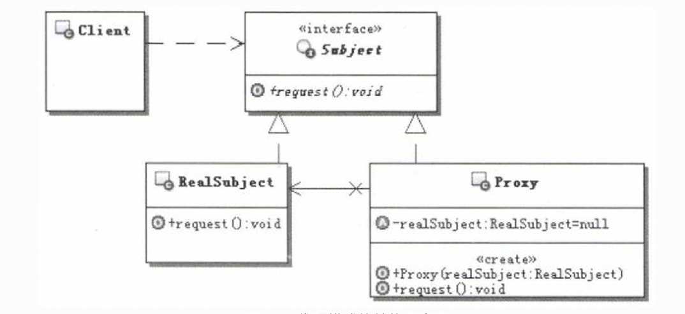

# 1.代理模式的目的
为其他对象提供一种代理以控制对这个对象的访问。 
代理模式是通过创建一个代理对象，用这个代理对象去代表真实的对象，客户端得到这个代理对象后，对客户端并没有什么影响，就跟得到了真实对象一样来使用。 
当客户端操作这个代理对象的时候，实际上功能最终还是会由真实的对象来完成，只不过是通过代理操作的，也就是客户端操作代理，代理操作真正的对象。 
正是因为有代理对象夹在客户端和被代理的真实对象中间，相当于一个中转，那么在中转的时候就有很多花招可以玩，比如，判断一下权限，如果没有足够的权限那就不给你中转了，等等。 
## 1.1.代理模式的分类
事实上代理又被分成多种，大致有如下：
- 虚代理：根据需要来创建开销很大的对象，该对象只有在需要的时候才会被真正创建。
- 远程代理：用来在不同的地址空间上代表同一个对象，这个不同的地址空间可以是在本机，也可以在其他机器上。在Java里面最典型的就是RMI技术。
- copy-on-write代理：在客户端操作的时候，只有对象确实改变了，才会真的拷贝（或克隆） 一个目标对象，算是虚代理的一个分支。
- 保护代理：控制对原始对象的访问，如果有需要，可以给不同的用户提供不同的访问权限， 控制他们对原始对象的访问。
- cache代理：为那些昂贵操作的结果提供临时的存储空间，以便多个客户端可以共享远丫结果。
- 防火墙代理：保护对象不被恶意用户访问和操作。
- 同步代理：使多个用户能够同时访问目标对象而没有冲突。
- 智能指引：在访问对象时执行一些附加操作，比如，对指向实际对象的引用计数、第一次引用一个持久对象时，将它装入内存等。

**使用频率最高的两种代理：虚代理和保护代理**。本节将对这两种使用频率最高的代理给出示例。
# 2.代理模式的实现
代理模式的结构示意图： 

- **Proxy**：代理对象，通常具有如下功能:
  - 实现与具体的目标对象一样的接口，这样就可以使用代理来代替具体的目标对象。保存一个指向具体目标对象的引用，可以在需要的时候调用具体的目标对象。
  - 可以控制对具体目标对象的访问，并可以负责创建和删除它。
- **subject**：目标接口，定义代理和具体目标对象的接口，这样就可以在任何使用具体目标对象的地方使用代理对象。
- **RealSubject**：具体的目标对象，真正实现目标接口要求的功能。

前面的实现的代理模式称为java的静态代理。这种实现方式有一个较大的缺点，就是如果Subject接口发生变化，那么代理类和具体的目标实现都要变化，不是
很灵活。而使用java内建的对代理模式支持的功能来实现则没有这个问题! 
**java中提供的两种代理方式，比如jdk动态代理和cglib动态代理。** 

代理模式的顺序示意图： 

# 3.案例说明
## 3.1.一次性访问多条数据（虚代理）
&nbsp;&nbsp;&nbsp;&nbsp;这个功能的背景是这样的；在一个HR（人力资源）应用项目中客户提出，当选择一个部门或是分公司的时候，要把这个部门或者
分公司下的所有员工都显示出来， 而且不要翻页，方便他们进行业务处理。在显示全部员工的时候，只需要显示名称即可，但是也需要提供如下的功能：在必要
的时候可以选择并查看某位员工的详细信息。 
&nbsp;&nbsp;&nbsp;&nbsp;客户方是一个集团公司，有些部门或者分公司可能有好几百人，不让翻页，也就是要求一次性地获取这多条数据并展示出来。 
&nbsp;&nbsp;&nbsp;&nbsp;该怎么样实现呢？ 

无设计模式：直接使用sql语句从数据库中查询所有的信息。 
使用代理模式解决问题：引入Proxy  
- **潜在问题**：如果客户对每条用户数据都要求查看详细数据的话，那么总的查询数据库的次数会是1+N次之多。
- **适用场景**：客户大多数情况下只需要查看用户编号和姓名，而少量的数据需要查看详细数据。这样既节省了内存，又减少了操作数据库的次数。

## 3.2.订单系统（保护代理）
保护代理：一种控制对原始对象访问的代理，多用于对象应该有不同的访问权限的时候。保护代理会检查调用者是否具有请求所必需的访问权限，如果没有相应的
权限，那么就不会调用目标对象，从而实现对目标对象的保护。 
示例需求： 一旦订单被创建，只有订单的创建人才可以修改订单中的数据，其他人则不能修改。 

## 3.3.订单系统（jdk内建动态代理）
Java对代理模式提供了内建的支持，在java.lang.reflect包下面，提供了一个Proxy的类和一个In-vocationHandler的接口。