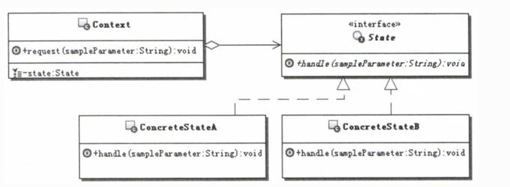
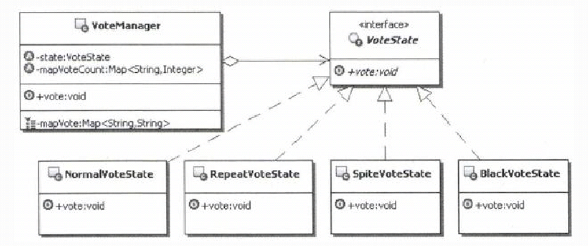
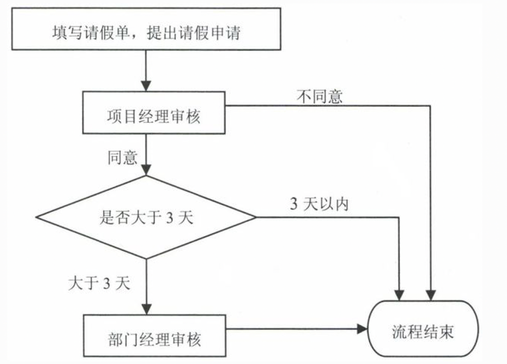

# 1.状态模式的目的
定义：允许一个对象在其内部状态改变时改变它的行为。对象看起来似乎修改了它的类。 
所谓对象的状态，通常指的就是对象实例的属性的值；而行为指的就是对象的功能，再具体点说， 行为大多可以对应到方法上。 
状态模式的功能就是分离状态的行为，通过维护状态的变化，来调用不同状态对应的不同功能。 
也就是说，状态和行为是相关联的，它们的关系可以描述为：状态决定行为。 
由于状态是在运行期被改变的，因此行为也会在运行期根据状态的改变而改变，看起来，同一个对象，在不同的运行时刻，行为是不一样的，就像是类被修改了一样。

# 2.状态模式的实现
&nbsp;&nbsp;&nbsp;&nbsp;仔细分析"在线投票"案例的问题，会发现，那几种用户投票的类型，就相当于是描述了人员的几种投票状态， 而各个状态和对应的功能处理
具有很强的对应性，有点类似于“一个萝卜一个坑”，各个状态下的处理基 本上都是不一样的，也不存在可以相互替换的可能。 
&nbsp;&nbsp;&nbsp;&nbsp;为了解决上面提出的问题，很自然的一个设计就是，首先把状态和状态对应的行为从原来的大杂烩 代码中分离出来，把每个状态
所对应的功能处理封装在一个独立的类里面，这样选择不同处理的时候， 其实就是在选择不同的状态处理类。 
&nbsp;&nbsp;&nbsp;&nbsp;为了统一操作这些不同的状态类，定义一个状态接口来约束它们，这样外部就可以面向这个统一的 状态接口编程，而无须关心具
体的状态类实现了。 
&nbsp;&nbsp;&nbsp;&nbsp;这样一来，要修改某种投票情況所对应的具体功能处理，只需直接修改或者扩展某个状态处理类的 功能就可以了。而要添加新的
功能就更简单，直接添加新的状态处理类就可以了，当然在使用Context 的时候，需要设置使用这个新的状态类的实例。 
状态模式的结构示意图： 
 
说明如下：
- Context：环境，也称上下文，通常用来定义客户感兴趣的接口，同时维护一个来具体处理当 前状态的实例对象。
- State：状态接口，用来封装与上下文的一个特定状态所对应的行为。
- ConcreteState：具体实现状态处理的类，每个类实现一个跟上下文相关的状态的具体处理。
# 3.案例说明
## 3.1.实现在线投票
&nbsp;&nbsp;&nbsp;&nbsp;考虑一个在线投票的应用，要实现控制同一个用户只能投一票，如果一个用户反复投票，而且投票次数超过5次，则判定为恶意
刷票，要取消该用户投票的资格，当然同时也要取消他所投的票；如果一个用户的投票次数超过8次，将进入黑名单，禁止再登录和使用系统。 
&nbsp;&nbsp;&nbsp;&nbsp;该怎么实现这样的功能呢？ 
### 3.1.1.不用模式的解决方案
&nbsp;&nbsp;&nbsp;&nbsp;分析上面的功能，为了控制用户投票，需要记录用户所投票的记录，同时还要记录用户投票的次数， 为了简单，直接使用两个Map来记录。
&nbsp;&nbsp;&nbsp;&nbsp;在投票的过程中，又有四种情况：
- 用户是正常投票。
- 用户正常投票以后，有意或者无意地重复投票。
- 用户恶意投票。
- 黑名单用户。

 
&nbsp;&nbsp;&nbsp;&nbsp;这几种情况下对应的处理是不一样的。 

### 3.1.2.使用状态模式的解决方案
 

### 3.1.3.状态模式的维护和转换
&nbsp;&nbsp;&nbsp;&nbsp;所谓状态的维护，指的是维护状态的数据，给状态设置不同的状态值；而状态的转换，指的是根据状态的变化来选择不同的状态
处理对象。在状态模式中，通常有两个地方可以进行状态的维护和转换控制。 
&nbsp;&nbsp;&nbsp;&nbsp;一个就是在上下文中。因为状态本身通常被实现为上下文对象的状态，因此可以在上下文中进行状态维护，当然也就可以控制状
态的转换了。前面投票的示例就是采用这种方式。 
&nbsp;&nbsp;&nbsp;&nbsp;另外一个地方就是在状态的处理类中。当每个状态处理对象处理完自身状态所对应的功能后，可以根据需要指定后继状态，以便
让应用能正确处理后续的请求。

## 3.2.模拟请假工作流
&nbsp;&nbsp;&nbsp;&nbsp;做企业应用的朋友，大多数都接触过工作流，至少也处理过业务流程。对于工作流，复杂的应用可能会使用工作流中间件，用工
作流引擎来负责流程处理，这个会比较复杂。其实工作流引擎的实现也可 以应用状态模式，这里不去讨论。 
&nbsp;&nbsp;&nbsp;&nbsp;简单点的，把流程数据存放在数据库中，然后在程序中自己来进行流程控制。对于简单的业务流程控制，可以使用状态模式来辅
助进行流程控制，因为大部分这种流程都是状态驱动的。 
&nbsp;&nbsp;&nbsp;&nbsp;举个例子来说明吧。比如最常见的“请假流程”，流程是这样的：当某人提出请假申请，先由项目经理审批，如果项目经理不同意，
审批就直接结束；如果项目经理同意了，再看请假的天数是否超过3天， 项目经理的审批权限只有3天以内，如果请假天数在3天以内，那么审批也直接结束，否
则就提交给部 门经理；部门经理审核过后，无论是否同意，审批都直接结束。 
 
&nbsp;&nbsp;&nbsp;&nbsp;仔细分析上面的流程图和运行过程，把请假单在流程中的各个阶段的状态分析出来，会发现，整个流程完全可以看成是状态驱动的。 
&nbsp;&nbsp;&nbsp;&nbsp;在上面的流程中，请假单大致有如下状态：等待项目经理审核、等待部门经理审核、审核结束。如果用状态驱动来描述上述流程： 
- （1）当请假人填写请假单，提出请假申请后，请假单的状态是等待项目经理审核状态。
- （2）当项目经理完成审核工作，提交保存后，如果项目经理不同意，请假单的状态是审核结束状态；如果项目经理同意，请假天数又在3天以内，请假单的状
态是审核结束状态；如果项目经理同意， 请假天数大于3天，请假单的状态是等待部门经理审核状态。
- （3）当部门经理完成审核工作，提交保存后，无论是否同意，请假单的状态都是审核结束状态。既然可以把流程看成是状态驱动的，那么就可以自然地使用状
态模式，每次当相应的工作人员完成 工作，请求流程响应的时候，流程处理的对象会根据当前所处的状态，把流程处理委托给相应的状态对 象去处理。
