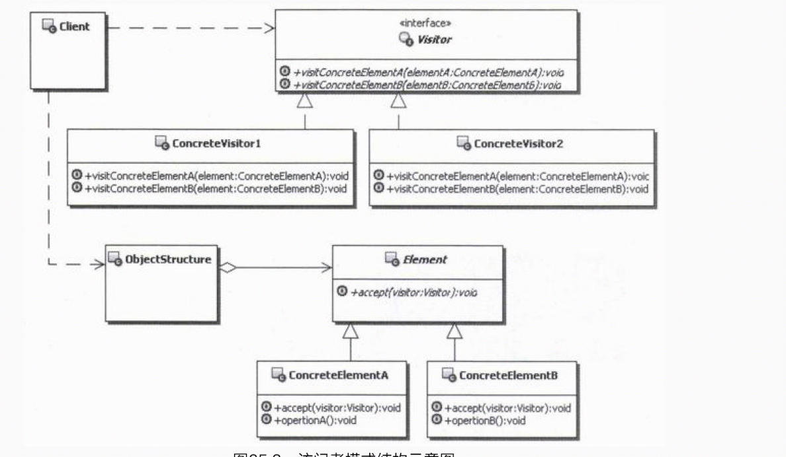
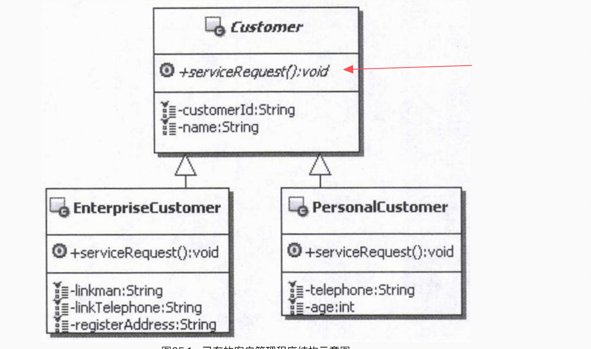

# 1.访问者模式的目的
表示一个作用于某对象结构中的各元素的操作。它使你可以在不改变各元素的类的前提下定义作用于这些元素的新操作。 

# 2.访问者模式的实现
 
说明如下： 
- Visitor：访问者接口，为所有的访问者对象声明一个visit方法，用来代表为对象结构添加的功 能，理论上可以代表任意的功能。
- ConcreteVisitor：具体的访问者实现对象，实现要真正被添加到对象结构中的功能。
- Element：抽象的元素对象，对象结构的顶层接口，定义接受访问的操作。
- ConcreteElement：具体元素对象，对象结构中具体的对象，也是被访问的对象，通常会回调 访问者的真实功能，同时开放自身的数据供访问者使用。
- ObjectStructure：对象结构，通常包含多个被访问的对象，它可以遍历多个被访问的对象， 也可以让访问者访问它的元素。可以是一个复合或是一个集合
，如一个列表或无序集合。

 
注意：  
&nbsp;&nbsp;&nbsp;&nbsp;这个ObjectStructure并不是我们在前面讲到的对象结构，前面一直讲的对象结构是 指的一系列对象的定义结构，是概念上的东西；而ObjectStructure可
以看成是对象结构中的一系列对 象的一个集合，是用来辅助客户端访问这一系列对象的。为了不造成大家的困惑，所以后面提到Ob-jectStructure的时候，就
用英文名称来代替，不把它翻译成中文。

# 3.案例说明
## 3.1.扩展客户管理功能
已有系统：客户管理。仅有服务申请功能。其现有实现代码架构如下： 
 

扩展系统：扩展现有客户管理的功能，比如增加偏好分析和价值分析
### 3.1.1.无设计模式的扩展
存在两个主要问题：
- 1.在企业客户和个人客户的类中，都分别实现了提出服务请求、进行产品偏好分析、进行客户价值分析等功能，也就是说，这些功能的实现代码是混杂在同一
个类中的；而且相同的功能分散到了不同 的类中去实现，会导致整个系统难以理解、难以维护。
- 2.更为痛苦的是，采用这样的实现方式，如果要给客户扩展新的功能，比如前面提到的针对不同 的客户进行需求调查、针对不同的客户进行满意度分析、客户
消费预期分析等。每次扩展，都需要改动 企业客户的类和个人客户的类，当然也可以通过为它们扩展子类的方式，但是这样可能会造成过多的对象层次。
 

思考： 
那么有没有办法，能够在不改变客户对象结构中各元素类的前提下，为这些类定义新的功能？也就 是要求不改变企业客户和个人客户类，就能为企业客户和个人 
客户类定义新的功能？
### 3.1.2.使用访问者模式扩展
&nbsp;&nbsp;&nbsp;&nbsp;访问者模式可解决上述的痛点。 
&nbsp;&nbsp;&nbsp;&nbsp;仔细分析上面的示例。对于客户这个对象结构，不想改变类，又要添加新的功能，很明显就需要一 种动态的方式，在运行期间把
功能动态地添加到对象结构中去。 
&nbsp;&nbsp;&nbsp;&nbsp;有些朋友可能会想起装饰模式，装饰模式可以实现为一个对象透明地添加功能，但装饰模式基本上 是在现有功能的基础之上进行
功能添加，实际上是对现有功能的加强或者改造，并不是在现有功能不改 动的情况下，为对象添加新的功能。 
&nbsp;&nbsp;&nbsp;&nbsp;看来需要另外寻找新的解决方式了，可以应用访问者模式来解决这个问题。访问者模式实现的基本 思路如下: 
- 1.首先定义一个接口来代表要新加入的功能，为了通用，也就是定义一个通用的功能方法来代表新加入的功能。
- 2.在对象结构上添加一个方法，作通用的功能方法，也就是可以代表被添加的功能，在这个方法中传入具体的实现新功能的对象。
- 3.在对象结构的具体实现对象中实现这个方法，回调传入具体的实现新功能的对象，就相当于调用到新功能上了。
- 4.接下来的步骤就是提供实现新功能的对象。 
- 5.最后再提供一个能够循环访问整个对象结构的类，让这个类来提供符合客户端业务需求的方法，来满足客户端调用的需要。

这样一来，只要提供实现新功能的对象给对象结构，就可以为这些对象添加新的功能，由于在对象结构中定义的方法是通用的功能方法，所以什么新功能都可以加入。 

## 3.2.访问者模式+组合模式
&nbsp;&nbsp;&nbsp;&nbsp;访问者模式一个很常见的应用，就是和组合模式结合使用，通过访问者模式来给由组合模式构建的对象结构增加功能。 
&nbsp;&nbsp;&nbsp;&nbsp;对于使用组合模式构建的组合对象结构，对外有一个统一的外观，要想添加新的功能也不是很困难，只要在组件的接口上定义新
的功能就可以了，糟糕的是这样一来，需要修改所有的子类。而且，每次添加一个新功能，都需要修改组件接口，然后修改所有的子类。 
&nbsp;&nbsp;&nbsp;&nbsp;为了让组合对象结构更灵活、更容易维护和有更好的扩展性，可以把它改造成访问者模式和组合模式组合来实现。这样在今后进
行功能改造的时候，就不需要再改动这个组合对象结构了。 
 
**提示:** 
访问者模式和组合模式组合使用的思路：首先把组合对象结构中的功能方法分离出来，虽然维护组合对象结构的方法也可以分离出来，但是为了维持组合对象结构
本身，这些方法还是放在组合对象结构中，然后把这些功能方法分别实现成访问者对象，通过访问者模式添加到组合的对象结构中去。